# 自動倉庫システム（スタッカークレーン）フローチャート

> **注意**: 本ドキュメントにはMermaid記法による図が含まれています。GitHub、VS Code、TyporaなどのMermaid対応のMarkdownビューアでご覧ください。

---

## 1. システム構成概要

### 1.1 全体構成図

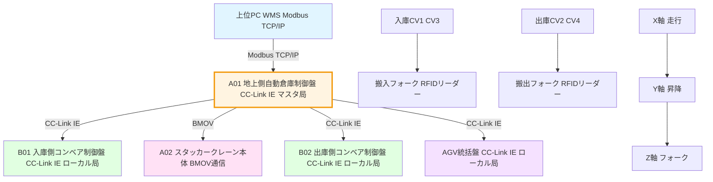

---

## 2. 通信プロトコル一覧

| 通信経路 | プロトコル | 詳細 |
|----------|-----------|------|
| PC ↔ A01 | Modbus TCP/IP | タスク送信、ステータス監視 |
| A01 ↔ A02 | 内部BMOV | スタッカー制御、位置・状態監視 |
| A01 ↔ B01 | CC-Link IE | 入庫側コンベア制御 |
| A01 ↔ B02 | CC-Link IE | 出庫側コンベア制御 |
| A01 ↔ AGV統括盤 | CC-Link IE | AGV連携 |

### 2.1 通信構成図

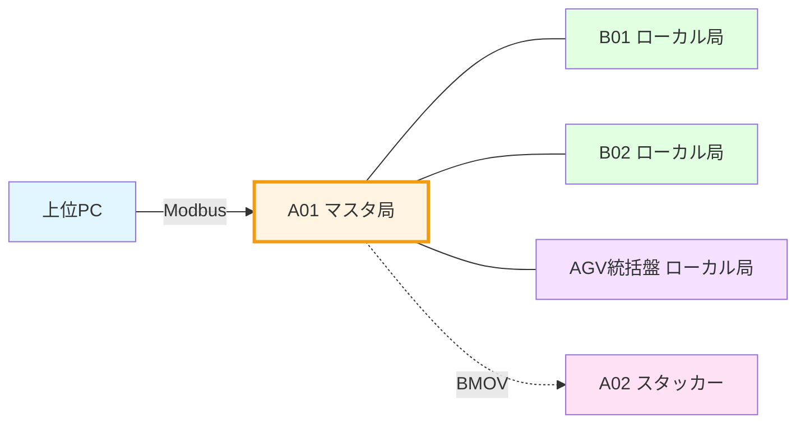

---

## 3. タスク種別フロー

### 3.1 タスク種別一覧

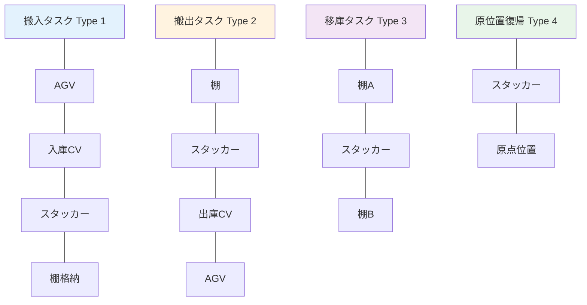

---

## 4. 搬入シーケンス詳細フロー

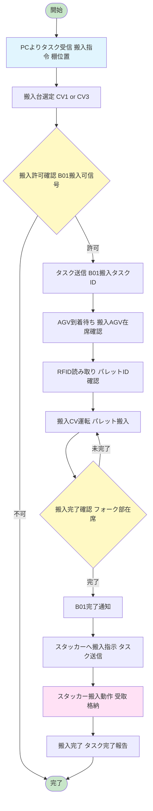

---

## 5. 搬出シーケンス詳細フロー

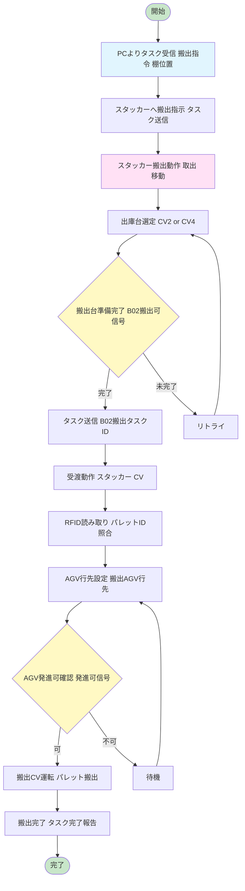

---

## 6. 入庫側コンベア（B01）制御フロー

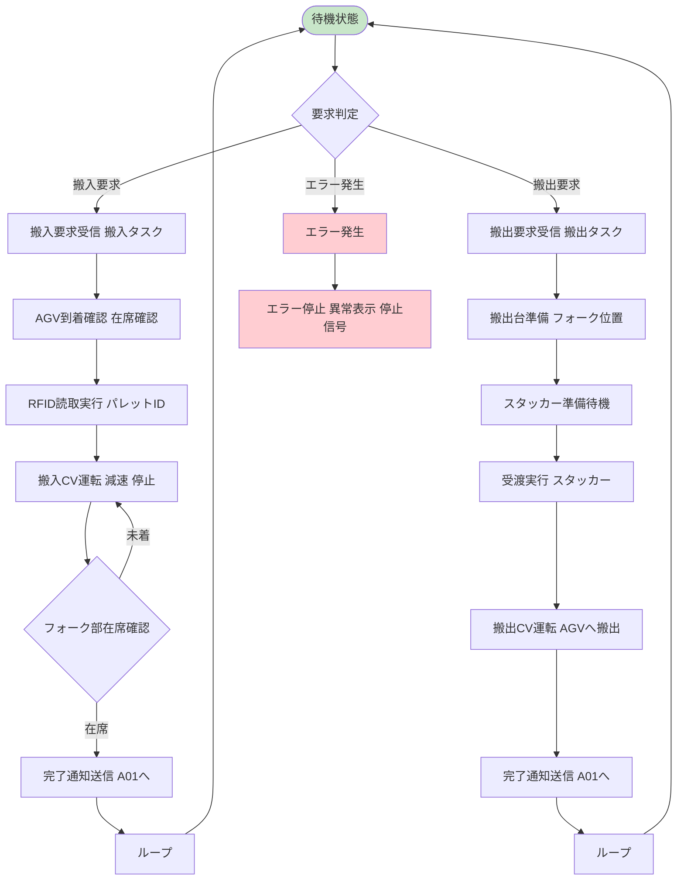

### 6.1 主要センサー一覧

| センサー名 | 機能 |
|-----------|------|
| 搬入CV減速・停止 | 搬入パレット位置検出 |
| 搬出CV減速・停止 | 搬出パレット位置検出 |
| 搬入/搬出フォーク上・下降端 | フォーク位置確認 |
| 搬入/搬出台上・下降端 | リフター位置確認 |
| 搬入/搬出フォーク部パレット在席 | パレット有無 |
| AGV在席検出 | AGV到着確認 |
| RFID読取値 | パレットID確認 |
| LC正常 | リミットスイッチ正常確認 |

---

## 7. 出庫側コンベア（B02）制御フロー

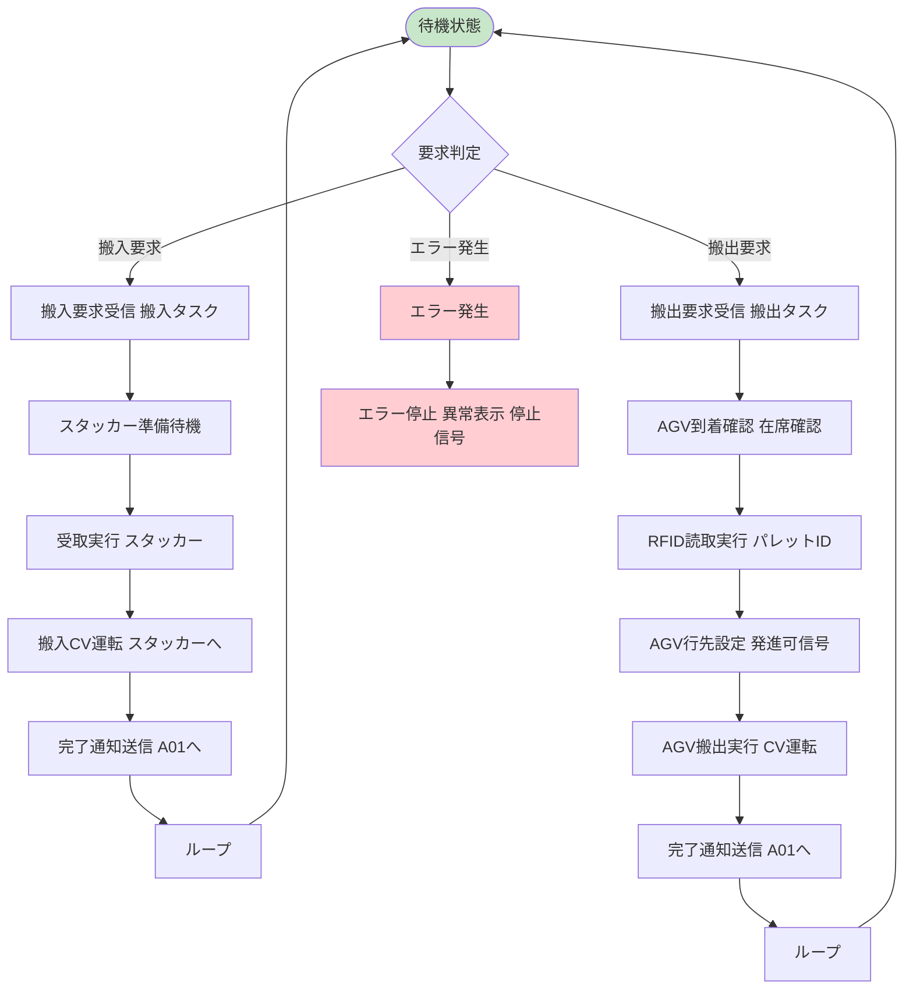

---

## 8. スタッカークレーン（A02）制御フロー

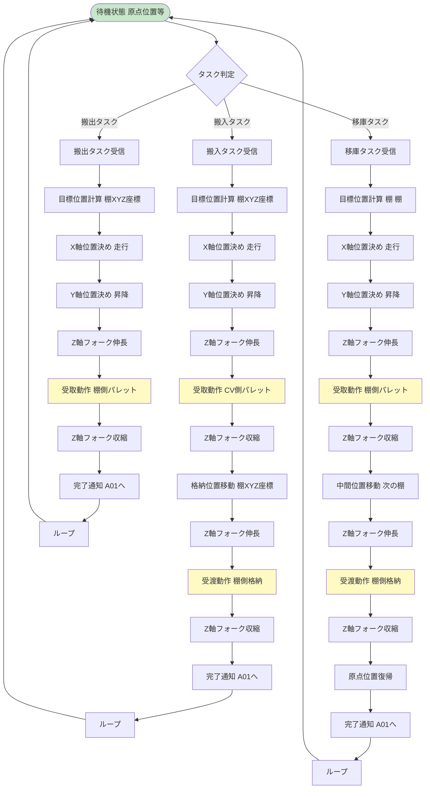

### 8.1 スタッカー軸構成

| 軸 | 機能 | センサー |
|----|------|----------|
| X軸（走行） | 列方向移動 | 前進/後退、減速/停止センサー |
| Y軸（昇降） | 層方向移動 | 上昇/下降、上/下限センサー |
| Z軸（フォーク） | 伸縮動作 | 左右動作、零点/伸縮限センサー |

### 8.2 状態監視項目

- 各軸位置（パルス数/座標変換値）
- 各軸速度
- 各軸トルク
- 各軸アラーム状態
- フォーク状態（受取中/受渡中/完了）

---

## 9. 信号タイミングチャート

### 9.1 搬入時シーケンス図

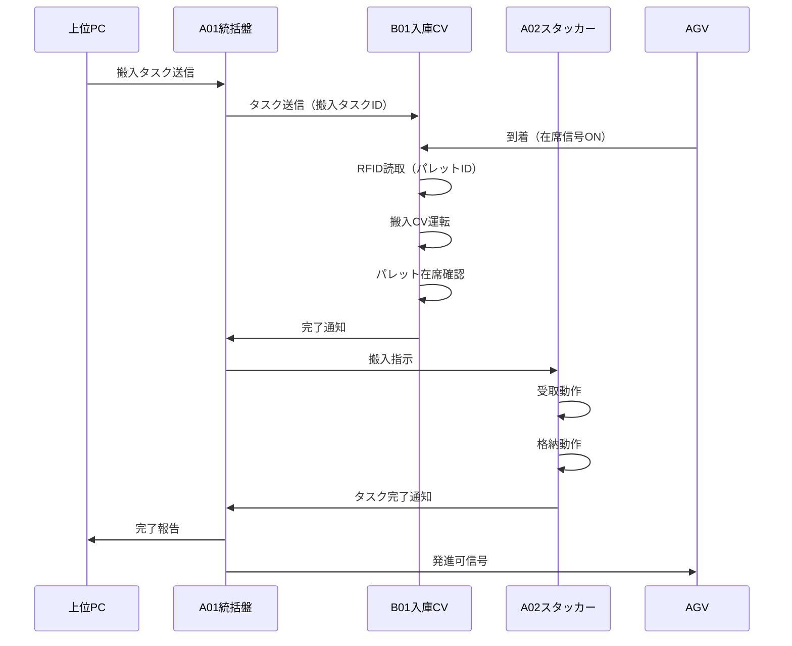

### 9.2 搬出時シーケンス図

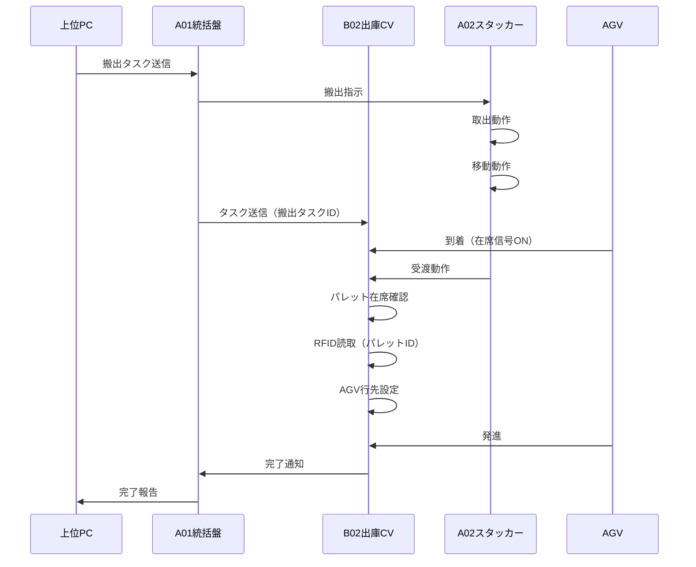

---

## 10. エラーハンドリングフロー

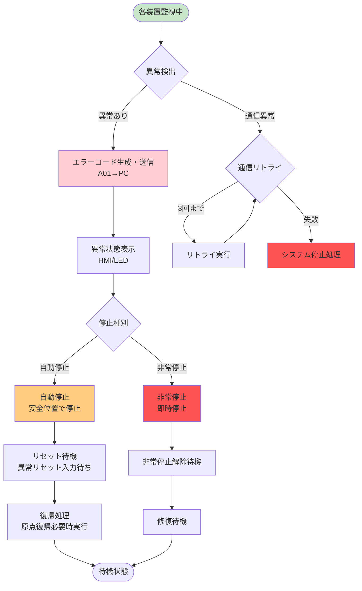

### 10.1 主要エラーコード一覧

| コード | 内容 |
|--------|------|
| E001 | 通信異常（PC/A01間） |
| E002 | 通信異常（A01/A02間） |
| E003 | 通信異常（A01/B01間） |
| E004 | 通信異常（A01/B02間） |
| E101 | スタッカーX軸オーバーラン |
| E102 | スタッカーY軸オーバーラン |
| E103 | スタッカーZ軸オーバーラン |
| E201 | RFID読取エラー |
| E202 | パレットID不一致 |
| E301 | コンベアモータ異常 |
| E302 | 安全ドア開放 |
| E303 | 非常停止スイッチON |

---

## 11. システム状態遷移図

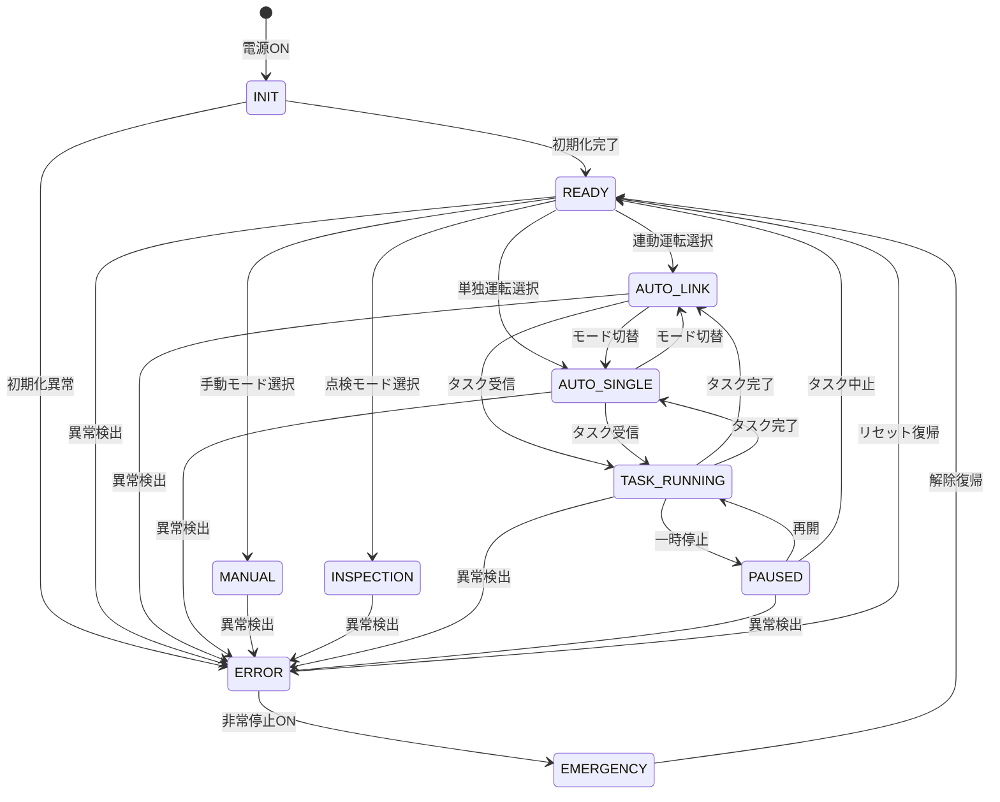

---

## 12. 運転モード一覧

| モード | 説明 | 特徴 |
|--------|------|------|
| 自動/連動 | PC連携運転 | PCからのタスク実行、最適化制御 |
| 自動/単独 | 単独運転 | A01のみでのタスク管理・実行 |
| 手動 | 手動運転 | 各軸個別操作、試運転用 |
| 点検 | 点検モード | メンテナンス用、制限速度 |

---

## 13. メモリマップ概要

### 13.1 PC ↔ A01 (Modbus)

| アドレス | 項目 | 方向 |
|----------|------|------|
| 40000-40029 | PC→A01 コマンド領域 | PC→A01 |
| 40050-40119 | A01→PC ステータス領域 | A01→PC |

### 13.2 A01 ↔ A02 (BMOV)

| 項目 | A01アドレス | A02アドレス |
|------|-------------|-------------|
| タスクデータ | D1100-D1129 | D3000-D3029 |
| ステータス | D3050-D3079 | D100-D129 |

### 13.3 A01 ↔ B01/B02 (CC-Link IE)

| 項目 | A01→CV | CV→A01 |
|------|--------|--------|
| ハートビート | Y1000 | D3000 |
| タスクID | Y1001-Y1002 | D3006 |
| RFID読値 | D3013 | D313 |

---

## 14. 装置IO一覧（抜粋）

### A01 主な入出力信号

**入力信号:**
| 信号 | 内容 |
|------|------|
| X1000-X102F | B01/B02入力信号 |
| M1036 | 搬入フォーク部パレット在席 |
| M1052-M1053 | 搬出CV停止・減速 |

**出力信号:**
| 信号 | 内容 |
|------|------|
| Y1000-Y102F | B01/B02出力信号 |
| Y102A | 搬入受取可 |
| Y102B | 搬出受渡可 |

### A02 主な入出力信号

**入力信号:**
| 信号 | 内容 |
|------|------|
| X103-X127 | 各軸位置・速度データ |
| X183-X185 | 各軸アラーム |

**出力信号:**
| 信号 | 内容 |
|------|------|
| Y100-Y119 | ステータス信号 |
| M90-M93 | フォーク状態信号 |

---

## 15. 付録

### 15.1 用語集

| 用語 | 説明 |
|------|------|
| スタッカー | スタッカークレーンの略。倉庫内でパレットを搬送するクレーン設備 |
| 搬入 | パレットを倉庫へ入れること |
| 搬出 | パレットを倉庫から出すこと |
| 移庫 | 倉庫内でパレットを別の棚へ移すこと |
| 原位置復帰 | スタッカーを原点位置へ戻すこと |
| RFID | 無線ICタグ。パレットのID管理に使用 |
| CC-Link IE | 三菱電機製産業用イーサネット通信 |
| BMOV | 三菱電機PLCのブロック転送命令 |

### 15.2 文書情報

- **作成日**: 2026-03-04
- **対象システム**: 自動倉庫システム（スタッカークレーン）
- **基準仕様**: PDF仕様書（ICE_地上盤_A01、ICE_スタッカー本体_A02、ICE_入庫側コンベア_B01、ICE_出庫側コンベア_B02、盤間信号）

---

*本フローチャートはPDF仕様書に基づき作成されました。*
*詳細なシグナル定義やパラメータについては、各装置仕様書をご参照ください。*
