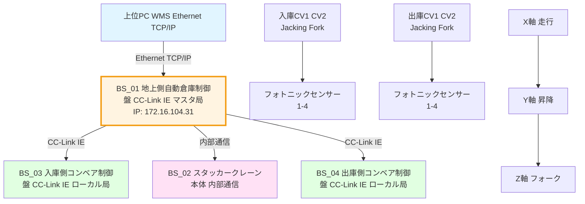
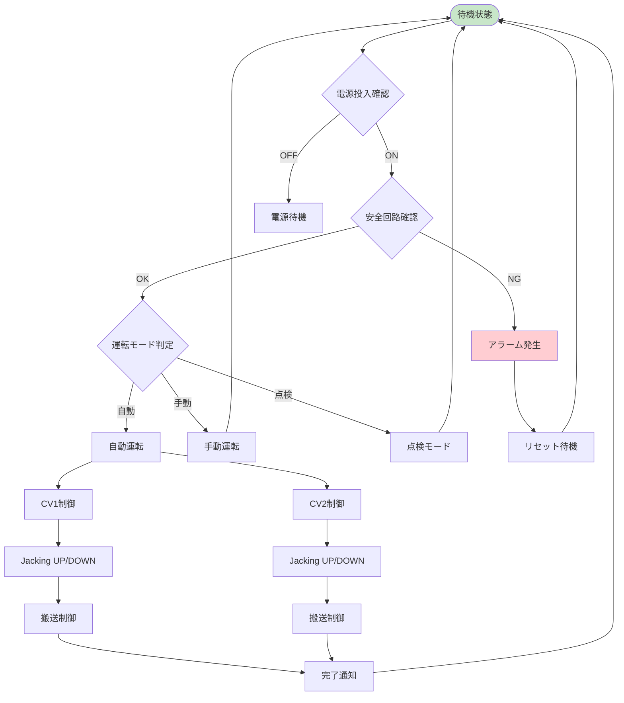
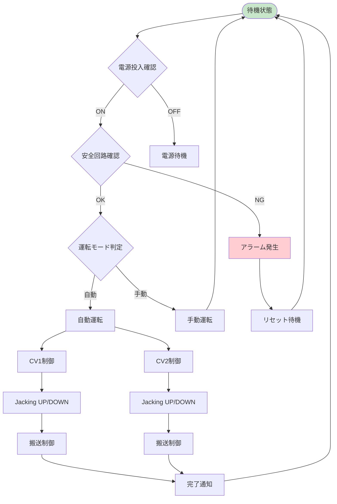
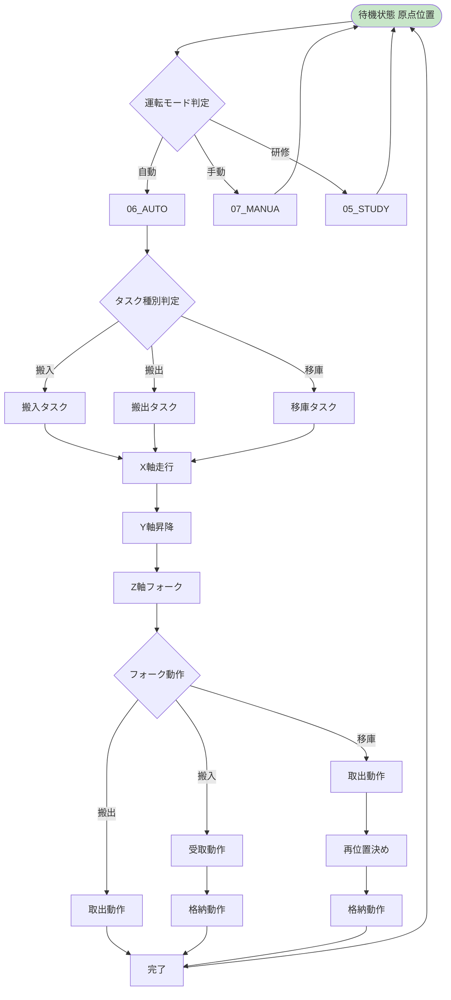
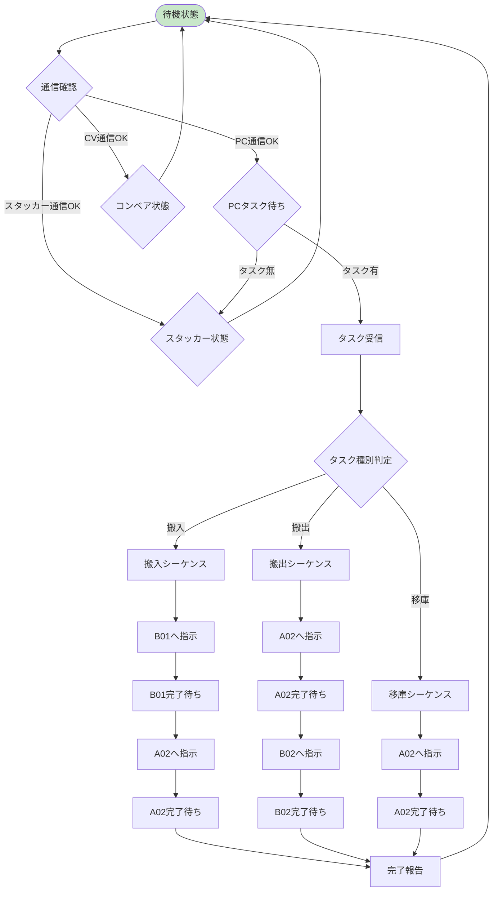
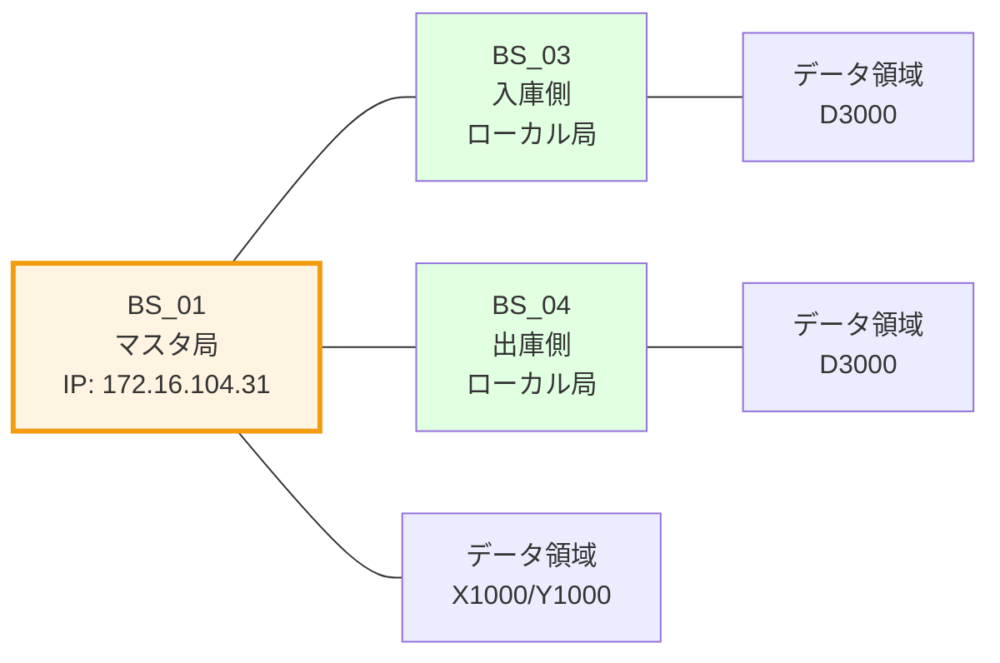
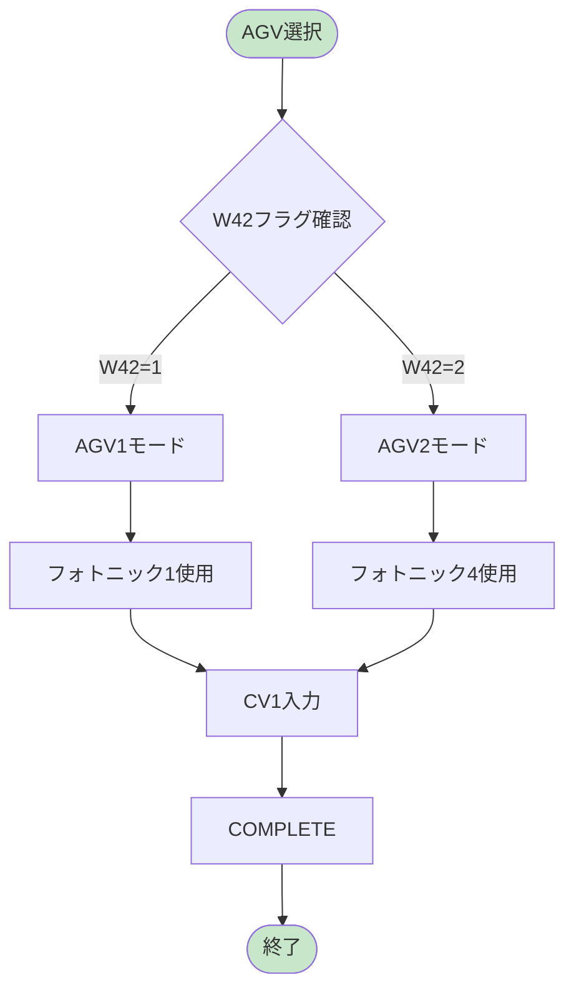
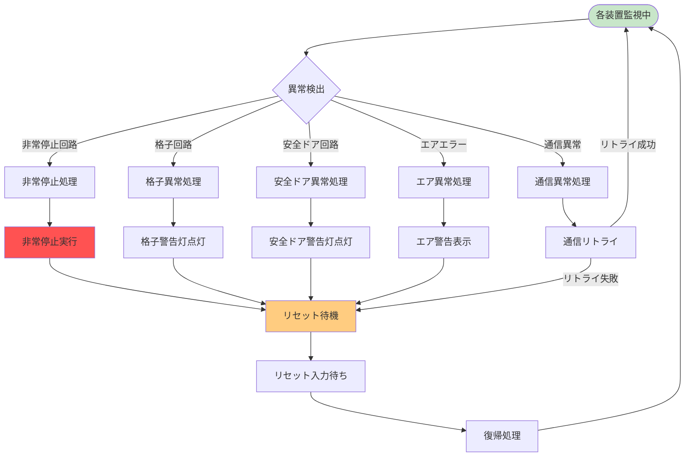

# 自動倉庫システム（スタッカークレーン）フローチャート - BSシリーズ

> **注意**: 本ドキュメントにはMermaid記法による図が含まれています。GitHub、VS Code、TyporaなどのMermaid対応のMarkdownビューアでご覧ください。

---

## 文書情報

- **作成日**: 2026-03-05
- **対象システム**: 自動倉庫システム（スタッカークレーン）- BSシリーズ
- **基準仕様**: BS_01〜BS_04 ラダープログラム仕様書

---

## 1. システム構成概要

### 1.1 全体構成図



---

## 2. 通信プロトコル一覧

| 通信経路 | プロトコル | 詳細 |
|----------|-----------|------|
| PC ↔ BS_01 | Ethernet TCP/IP | タスク送信、ステータス監視、IP: 172.16.104.31 |
| BS_01 ↔ BS_02 | 内部通信 | スタッカー制御、位置・状態監視 |
| BS_01 ↔ BS_03 | CC-Link IE | 入庫側コンベア制御 |
| BS_01 ↔ BS_04 | CC-Link IE | 出庫側コンベア制御 |

---

## 3. プログラム構成一覧

### 3.1 BS_01 地上側自動倉庫（A01）

| プログラム | 機能 |
|-----------|------|
| MAIN | メイン制御 |
| IO | 入出力制御 |
| FUNC | 機能制御 |
| MASTER | マスタ通信制御 |
| CC_LINK | CC-Link IE通信制御 |
| ALARM | アラーム処理 |

### 3.2 BS_02 スタッカークレーン本体（A02）

| プログラム | 機能 |
|-----------|------|
| MAIN | メイン制御 |
| 02_IO | 入出力制御（X40-X78） |
| 03_FUNC | 機能制御 |
| 04MASTER | マスタ通信制御 |
| 05_STUDY | 研修用 |
| 06_AUTO | 自動運転制御 |
| 07_MANUA | 手動運転制御 |
| 08_ALARM | アラーム処理 |
| 09_DRIVE | ドライブ制御 |

### 3.3 BS_03 入庫側コンベア（B01）

| プログラム | 機能 |
|-----------|------|
| MAIN | メイン制御 |
| IO | 入出力制御（X60-XFF） |
| CCLINK | CC-Link IE通信制御 |
| FUNC | 機能制御 |
| MANUAL | 手動運転制御 |
| ALARM | アラーム処理 |
| DRIVE | ドライブ制御 |

### 3.4 BS_04 出庫側コンベア（B02）

| プログラム | 機能 |
|-----------|------|
| MAIN | メイン制御 |
| IO | 入出力制御（X60-XFF） |
| CCLINK | CC-Link IE通信制御 |
| FUNC | 機能制御 |
| MANUAL | 手動運転制御 |
| ALARM | アラーム処理 |
| DRIVE | ドライブ制御 |

---

## 4. 入庫側コンベア（BS_03）制御フロー

### 4.1 メイン制御フロー



### 4.2 主要入出力信号

**入力信号（X60-XFF）:**

| 信号名 | アドレス | 機能 |
|--------|---------|------|
| In_Power | X60 | 電源投入 |
| B01_Emergency_Stop_Circuit1 | X62 | B01非常停止回路1 |
| B01_Emergency_Stop_Circuit2 | X63 | B01非常停止回路2 |
| B01_Grating_Circuit1 | X64 | B01格子回路1 |
| B01_Grating_Circuit2 | X65 | B01格子回路2 |
| B01_Safety_Door_Circuit1 | X66 | B01安全ドア回路1 |
| B01_Safety_Door_Circuit2 | X67 | B01安全ドア回路2 |
| AO1Safety_Circuit1 | X68 | AO1安全回路1 |
| AO1Safety_Circuit2 | X69 | AO1安全回路2 |
| B02_Emergency_Stop_Circuit1 | X6A | B02非常停止回路1 |
| B02_Emergency_Stop_Circuit2 | X6B | B02非常停止回路2 |
| B02_Grating_Circuit1 | X6C | B02格子回路1 |
| B02_Grating_Circuit2 | X6D | B02格子回路2 |
| B02_Safety_Door_Circuit1 | X6E | B02安全ドア回路1 |
| B02_Safety_Door_Circuit2 | X6F | B02安全ドア回路2 |
| Manual_Auto | X70 | 手動/自動切替 |
| Single_OnLine | X71 | 単独/オンライン切替 |
| Admin | X73 | 管理者スイッチ |
| Alarm_Reset | X74 | アラームリセット |
| Ready_Button | X75 | 準備ボタン |
| Start_Button | X76 | スタートボタン |
| Pause_Button | X77 | 一時停止ボタン |
| Lamp_Check | X78 | ランプチェック |
| Operational_Ready1 | X7A | 運転準備1 |
| Operational_Ready2 | X7B | 運転準備2 |
| Air_Error | X7E | エアエラー |

**コンベア入力信号:**

| 信号名 | アドレス | 機能 |
|--------|---------|------|
| CV01-CV011 | X80-X8F | CV1センサー |
| CV01AGV-CV01AGV2 | X8A-X8C | CV1 AGVセンサー |
| Bx03-CV022 | X90-X99 | CV2センサー |
| Bx03AGV-Bx03AGV2 | X9A-X9C | CV2 AGVセンサー |
| Bx02-Bx04 | XA0-XAF | フォークセンサー |

**AGV/フォトニックセンサー:**

| 信号名 | アドレス | 機能 |
|--------|---------|------|
| AGV1-AGV12 | XB0-XB3 | AGVセンサー1-2 |
| CV_IN1/CV_IN2 | XB4/XB5 | 入庫CV1/2 |
| CV_Out1/CV_Out2 | XB6/XB7 | 出庫CV1/2 |
| Photonic1_output1-4 | XC0-XC3 | フォトニック1出力1-4 |
| Photonic1_Go | XC4 | フォトニック1Go |
| Photonic2_output1-4 | XC6-XC9 | フォトニック2出力1-4 |
| Photonic2_Go | XCA | フォトニック2Go |
| Photonic3_output1-4 | XCC-XCF | フォトニック3出力1-4 |
| Photonic3_Go | XD0 | フォトニック3Go |
| Photonic4_output1-4 | XD2-XD5 | フォトニック4出力1-4 |
| Photonic4_Go | XD6 | フォトニック4Go |

**出力信号（YE0-Y12F）:**

| 信号名 | アドレス | 機能 |
|--------|---------|------|
| Pole_Light_R/Y/G | YE0/YE1/YE2 | 柱ライトR/Y/G |
| HA01_Sound1-4 | YE3-YE6 | ブザー1-4 |
| Ready_Button_Indicator_Light | YE8 | 準備ボタン指示灯 |
| Start_Button_Indicator_Light | YE9 | スタートボタン指示灯 |
| Pause_Button_Indicator_Light | YEA | 一時停止ボタン指示灯 |
| SafetyDoor_Indicator_Light | YEE | 安全ドア指示灯 |
| Unlock_SafetyDoor | YEF | 安全ドア解錠 |

**CV1出力（YF0-YFF）:**

| 信号名 | アドレス | 機能 |
|--------|---------|------|
| CV1_JackingUP_Fork_Run | YF0 | CV1ジャッキングUPフォーク運転 |
| CV1_JackingDown_Fork_Run | YF1 | CV1ジャッキングDOWNフォーク運転 |
| CV1_Jacking_Fork_Reset | YF2 | CV1ジャッキングフォークリセット |
| Grat1_Warning_Light_R/G | YF4/YF5 | 格子1警告灯R/G |
| CV1_JackingUP_Run | YF6 | CV1ジャッキングUP運転 |
| CV1_JackingDown_Run | YF7 | CV1ジャッキングDOWN運転 |
| CV1_Jacking_Reset | YF8 | CV1ジャッキングリセット |
| CV1_ConveyingIN_Run | YFA | CV1搬入運転 |
| CV1_ConveyingOut_Run | YFB | CV1搬出運転 |
| CV1_Conveying_SpeedA/B | YFC/YFD | CV1搬送速度A/B |
| CV1_Conveying_Reset | YFE | CV1搬送リセット |

**CV2出力（Y100-Y10F）:**

| 信号名 | アドレス | 機能 |
|--------|---------|------|
| CV2_JackingUP_Fork_Run | Y100 | CV2ジャッキングUPフォーク運転 |
| CV2_JackingDown_Fork_Run | Y101 | CV2ジャッキングDOWNフォーク運転 |
| CV2_Jacking_Fork_Reset | Y102 | CV2ジャッキングフォークリセット |
| Grat2_Warning_Light_R/G | Y104/Y105 | 格子2警告灯R/G |
| CV2_JackingUP_Run | Y106 | CV2ジャッキングUP運転 |
| CV2_JackingDown_Run | Y107 | CV2ジャッキングDOWN運転 |
| CV2_Jacking_Reset | Y108 | CV2ジャッキングリセット |
| CV2_ConveyingIN_Run | Y10A | CV2搬入運転 |
| CV2_ConveyingOut_Run | Y10B | CV2搬出運転 |
| CV2_Conveying_SpeedA/B | Y10C/Y10D | CV2搬送速度A/B |
| CV2_Conveying_Reset | Y10E | CV2搬送リセット |

**フォトニック出力（Y110-Y11F）:**

| 信号名 | アドレス | 機能 |
|--------|---------|------|
| Photonic1_Input1-4 | Y110-Y113 | フォトニック1入力1-4 |
| Photonic2_Input1-4 | Y114-Y117 | フォトニック2入力1-4 |
| Photonic3_Input1-4 | Y118-Y11B | フォトニック3入力1-4 |
| Photonic4_Input1-4 | Y11C-Y11F | フォトニック4入力1-4 |

---

## 5. 出庫側コンベア（BS_04）制御フロー

### 5.1 メイン制御フロー



### 5.2 BS_03との相違点

| 項目 | BS_03（入庫側） | BS_04（出庫側） |
|------|----------------|----------------|
| 搬入/搬出 | AGV→コンベア→スタッカー | スタッカー→コンベア→AGV |
| AGV切替 | W42=1: AGV1使用 | W42=1: AGV1使用 |
| AGV切替 | W42=2: AGV2使用 | W42=2: AGV2使用 |
| 制御フロー | 基本同じ | 基本同じ |

---

## 6. スタッカークレーン（BS_02）制御フロー

### 6.1 メイン制御フロー



### 6.2 入力信号（X40-X78）

| 信号名 | アドレス | 機能 |
|--------|---------|------|
| X40 | X40 | センサー0 |
| X41 | X41 | センサー10 |
| X42 | X42 | センサー13 |
| X43 | X43 | センサー16 |
| X44 | X44 | センサー19 |
| X45 | X45 | センサー22 |
| X46 | X46 | センサー25 |
| X47 | X47 | センサー28 |
| X48 | X48 | センサー31 |
| X49 | X49 | センサー34 |
| X4D | X4D | センサー46 |
| X4E | X4E | センサー49 |
| X4F | X4F | センサー52 |
| X50 | X50 | センサー55 |
| X51 | X51 | センサー65 |
| X52 | X52 | センサー68 |
| X53 | X53 | センサー71 |
| X54 | X54 | センサー74 |
| X55 | X55 | センサー77 |
| X56 | X56 | センサー80 |

---

## 7. 地上側自動倉庫（BS_01）制御フロー

### 7.1 メイン制御フロー



### 7.2 CC-Link IE通信構成



---

## 8. AGV切り替え機能

BS_03/BS_04では、W42フラグによってAGVを切り替える機能があります。

### 8.1 AGV切り替えフロー



### 8.2 AGV切り替えロジック（ST言語）

```
(* フォトニック出力切り替え *)
IF W42=1 THEN
    DInput.Photonic1_output1:=XC0;
    DInput.Photonic1_output2:=XC1;
    DInput.Photonic1_output3:=XC2;
    DInput.Photonic1_output4:=XC3;
    DInput.Photonic1_Go:=XC4;
ELSIF W42=2 THEN
    DInput.Photonic4_output1:=XC0;
    DInput.Photonic4_output2:=XC1;
    DInput.Photonic4_output3:=XC2;
    DInput.Photonic4_output4:=XC3;
    DInput.Photonic4_Go:=XC4;
END_IF;
```

---

## 9. エラーハンドリングフロー

### 9.1 エラー検出フロー



### 9.2 主要エラー検出信号

| エラー種別 | 検出信号 | アドレス |
|-----------|---------|---------|
| 非常停止回路1 | B01_Emergency_Stop_Circuit1 | X62/X63 |
| 非常停止回路2 | B02_Emergency_Stop_Circuit1 | X6A/X6B |
| 格子回路1 | B01_Grating_Circuit1 | X64/X65 |
| 格子回路2 | B02_Grating_Circuit1 | X6C/X6D |
| 安全ドア回路1 | B01_Safety_Door_Circuit1 | X66/X67 |
| 安全ドア回路2 | B02_Safety_Door_Circuit1 | X6E/X6F |
| エアエラー | Air_Error | X7E |

---

## 10. 運転モード一覧

| モード | 説明 | 対象プログラム |
|--------|------|--------------|
| 自動/オンライン | PC連携運転 | BS_01 MAIN, BS_02 06_AUTO, BS_03/04 MAIN |
| 自動/単独 | 単独運転 | BS_01 MAIN, BS_02 06_AUTO, BS_03/04 MAIN |
| 手動 | 手動運転 | BS_02 07_MANUA, BS_03/04 MANUAL |
| 点検 | 点検モード | BS_02 05_STUDY |

---

## 11. 用語集

| 用語 | 説明 |
|------|------|
| スタッカー | スタッカークレーンの略。倉庫内でパレットを搬送するクレーン設備 |
| 搬入 | パレットを倉庫へ入れること |
| 搬出 | パレットを倉庫から出すこと |
| 移庫 | 倉庫内でパレットを別の棚へ移すこと |
| Jacking | ジッキング。リフターによる昇降動作 |
| フォトニック | フォトセンサーによる位置検出システム |
| CC-Link IE | 三菱電機製産業用イーサネット通信 |
| AGV | 無人搬送車 |
| 格子 | 安全格子。安全装置の一つ |
| 安全ドア | 安全ドア interlock |
| W42 | AGV切り替えフラグ（1:AGV1, 2:AGV2） |

---

## 12. BSシリーズとICEシリーズの相違点

| 項目 | BSシリーズ | ICEシリーズ |
|------|-----------|-------------|
| CPU | Q03UDV | - |
| 通信 | Ethernet TCP/IP + CC-Link IE | Modbus TCP/IP + CC-Link IE + BMOV |
| 上位PC通信 | Ethernet TCP/IP | Modbus TCP/IP |
| A01-A02間通信 | 内部通信 | BMOV |
| プログラム言語 | ラダー + ST | ラダー |
| AGV切替 | W42フラグで切り替え | - |
| フォトニック | 1-4系統切替可能 | 固定 |

---

*本フローチャートはBS_01〜BS_04ラダープログラム仕様書に基づき作成されました。*
*詳細なシグナル定義やパラメータについては、各装置仕様書をご参照ください。*
