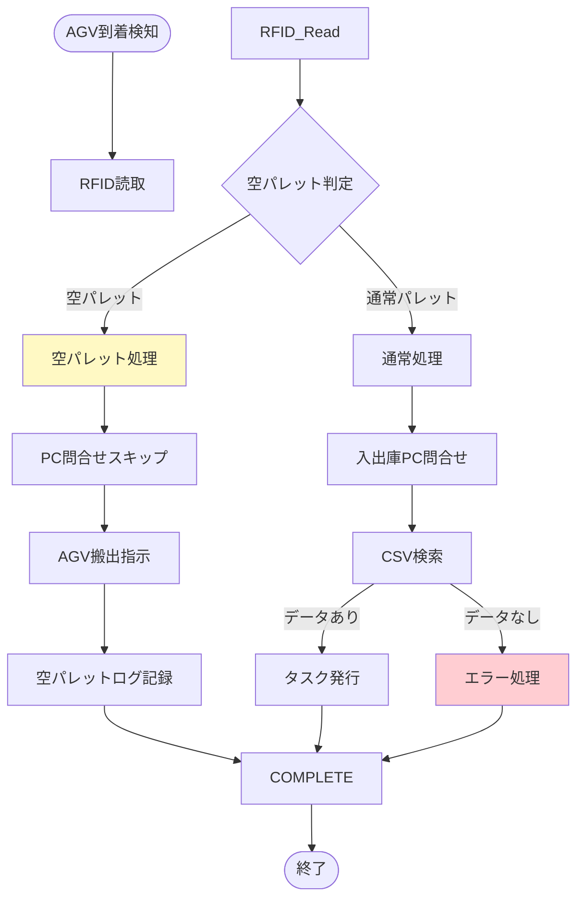
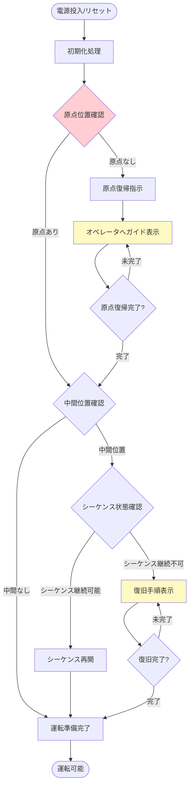
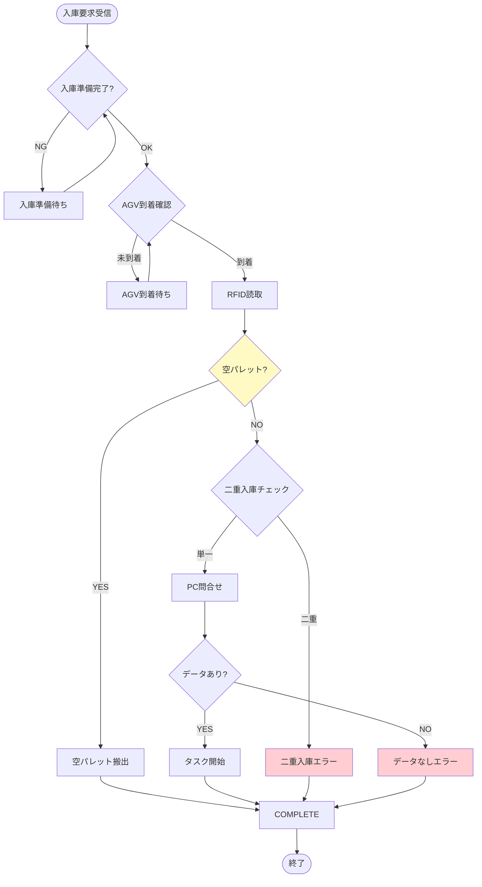
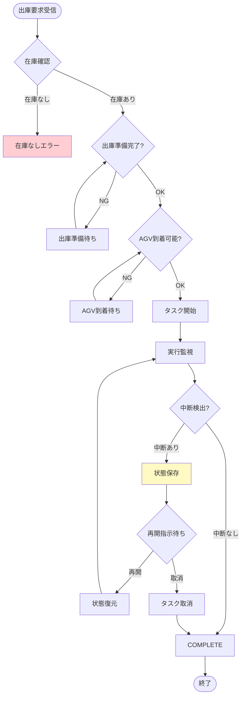
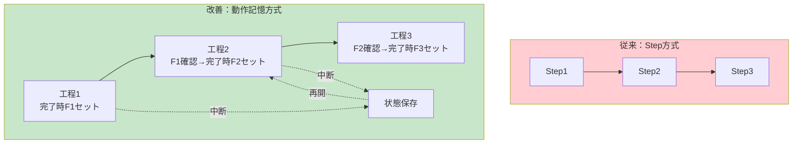
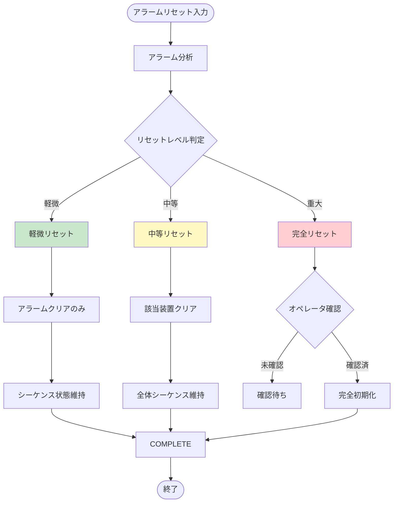

# 自動倉庫システム 技術改善レポート
## BSオリジナルST版：顕在化問題への包括的対応策

---

## 文書情報

| 項目 | 内容 |
|------|------|
| **作成日** | 2026-03-24 |
| **対象システム** | 自動倉庫システム（スタッカークレーン）- BSシリーズ |
| **基準仕様** | BS_01〜BS_04 ラダープログラム仕様書 |
| **版数** | Rev.2（問題１追加対応版） |

---

## 1. 顕在化している問題一覧

### 1.1 問題１：空パレットによるシステム停止

**現象**:
- プレス機段取り替え時にAGVが空パレットを持ってくる
- B01が空のRFIDを読み取り→入出庫PCに問い合わせ
- CSVに該当データなし→タスク発行されず
- システム停止：各盤を切り離したり、PCを再起動する必要がある

**影響**:
- システム稼働率低下
- オペレータ負荷増大
- デッドロック状態発生

### 1.2 問題２：エラー停止時の復帰困難

**現象**:
- 一時停止→再起動が可能な停止と、アラームリセットで完全初期化される停止が混在
- Step途中で停止した場合、ジョグでStep動作端まで操作し、Step番号を修正する必要がある
- すべての装置を元位置に戻して最初からやり直す必要がある

**影響**:
- 復旧時間の長期化
- オペレータスキル依存
- 作業効率低下

---

## 2. 問題分析

### 2.1 問題１の分析

**根本原因**:
```
[現状フロー]
AGV到着 → B01がRFID読取 → 入出庫PC問合せ → CSV検索
                                    ↓
                            該当データなし（空パレット）
                                    ↓
                            エラー応答なし → デッドロック
```

**技術的課題**:
1. RFID読み取り時に「空パレット」を判別する機能がない
2. 入出庫PCソフトに「該当データなし」時のエラー処理がない
3. PLC側で空パレットをフィルタリングする処理がない

### 2.2 問題２の分析

**根本原因**:
1. 固定シーケンス（Step方式）のため中間工程からの再開が困難
2. アラームリセット時に過剰な初期化を実行
3. 現在位置状態とシーケンス状態の整合性チェックが不十分

---

## 3. 技術的改善項目

### 3.1 空パレット検出・処理機能の追加【新規】

#### 3.1.1 基本方針

空パレット検出にあたっては、以下のいずれかの方法を採用する：

| 方法 | 概要 | メリット | デメリット |
|------|------|----------|------------|
| A案：RFID判別 | RFIDデータで空パレット識別 | 確実な判別 | RFID仕様の事前確認が必要 |
| B案：フォトニック判別 | フォトセンサーでパレット有無検出 | ハードウェア変更不要 | 検出精度の課題 |
| C案：組合せ | RFID + フォトニック二重判別 | 高信頼性 | 複雑化 |

**推奨**: A案（RFID判別）を基本とし、詳細確認後にB案・C案を検討

#### 3.1.2 RFID判別方式（A案）

**処理フロー**:



**空パレット判定ロジック**:

```
(* ST言語による空パレット判定処理 *)

(* 空パレットRFIDコード定義 *)
EMPTY_PALLET_CODE := 'E0000000';  (* 例：空パレット識別コード *)

(* RFIDデータ読取後の判定 *)
IF RFID_Data = EMPTY_PALLET_CODE THEN
    (* 空パレット検出時 *)
    DOutput.Empty_Pallet_Detected := TRUE;
    DOutput.Skip_PC_Query := TRUE;
    DOutput.AGV_Return_Command := TRUE;

    (* 空パレットログ記録 *)
    DStatus.Empty_Pallet_Count := DStatus.Empty_Pallet_Count + 1;
    DStatus.Last_Empty_Pallet_Time := CURRENT_TIME;

    (* アラーム通知 *)
    DOutput.Info_Alarm := TRUE;  (* 情報レベル、警報停止なし *)
    DOutput.Alarm_Code := 'INFO001';

ELSE
    (* 通常パレット処理へ *)
    DOutput.Empty_Pallet_Detected := FALSE;
    DOutput.Skip_PC_Query := FALSE;
    DOutput.Normal_Process := TRUE;
END_IF;
```

#### 3.1.3 入出庫PCソフト改修案

**エラー処理追加**:

```
【処理フロー】
1. PLCからのRFID問合せを受信
2. CSVファイル検索実行
3. 検索結果判定
   ├─ 該当データあり → 通常応答
   └─ 該当データなし → 空パレット応答
4. 空パレット応答時
   ├─ PLCへ「空パレット」コード返信
   └─ ログ記録
```

**応答コード仕様**:

| コード | 意味 | PLC動作 |
|------|------|---------|
| 00 | 正常（該当データあり） | 通常処理継続 |
| 01 | 空パレット | AGV搬出処理へ |
| 99 | その他エラー | アラーム発生 |

#### 3.1.4 実装要件

| 項目 | 要件内容 |
|------|----------|
| RFID仕様確認 | 空パレット識別コードの定義有無確認 |
| PLC変更 | B01プログラム（MAIN/FUNC）改修 |
| PCソフト変更 | 空パレット応答処理追加 |
| 通信仕様 | 応答コードの追加定義 |
| テスト項目 | 空パレット搬入テスト、通常パレット搬入テスト |

---

### 3.2 起動時異常検出・復旧機能の強化

#### 3.2.1 現状問題

- Step途中で停止後の復旧方法が不明确
- ジョグ操作とStep番号修正に熟練を要する

#### 3.2.2 改善方針

起動時に現在の装置状態をチェックし、異常があれば自動復旧または復旧ガイドを表示する。

**起動時チェックフロー**:



#### 3.2.3 状態チェック項目

| チェック項目 | 確認内容 | 異常時処置 |
|-------------|----------|-----------|
| 原点位置 | X・Y・Z軸が原点にあるか | 原点復帰実施 |
| 中間位置 | どの工程中に停止したか | その工程から再開 |
| パレット有無 | フォーク上有無 | パレット処理実施 |
| タスク状態 | 未完了タスク有無 | タスク再開または取消 |
| アラーム状態 | アラーム有無 | アラーム要因排除 |

#### 3.2.4 HMIガイダンス表示

**原点位置外の場合**:
```
┌─────────────────────────────────┐
│     【復旧ガイド】                │
│                                  │
│  現在：原点位置外                 │
│  処置：ジョグ運転で原点復帰してください│
│        [詳細手順]ボタンで確認      │
│                                  │
│     [詳細手順]  [閉じる]          │
└─────────────────────────────────┘
```

**中間位置から再開する場合**:
```
┌─────────────────────────────────┐
│     【再開確認】                  │
│                                  │
│  現在：入庫CV2搬送中に停止         │
│  処置：そのまま再開しますか？       │
│                                  │
│     [再開]  [原点復帰]            │
└─────────────────────────────────┘
```

---

### 3.3 入庫要求処理の見直し

#### 3.3.1 現状問題

- 入庫要求時の整合性チェックが不十分
- 空パレット対応がない

#### 3.3.2 改善処理フロー



---

### 3.4 出庫処理の見直し

#### 3.4.1 現状問題

- 出庫要求時の整合性チェックが不十分
- 中断時の再開処理が不備

#### 3.4.2 改善処理フロー



---

### 3.5 工程進行管理方式の抜本的改善

#### 3.5.1 現状：Step方式の問題点

```
【現状：Step方式】
Step1 → Step2 → Step3 → Step4 → ...
   ↓
中断時：Step番号を修正して再開
   ↓
問題：固定シーケンスのため柔軟性がない
```

#### 3.5.2 改善案：動作記憶方式への移行

**基本概念**:
- 各工程完了時に「完了フラグ」をセット
- 次工程は「直前工程完了フラグ」を確認して実行
- 段替えフラグ管理で中間工程から再開可能



**フラグ管理構造**:

| フラグ | 用途 | 設定タイミング |
|--------|------|---------------|
| F_RecvComplete | 入庫受取完了 | 入庫CV2搬送完了時 |
| F_StoreComplete | 格納完了 | スタッカー格納完了時 |
| F_PickComplete | 取出完了 | スタッカー取出完了時 |
| F_SendComplete | 出庫送付完了 | 出庫CV2搬送完了時 |
| F_StageChange | 段替え中 | 移庫または段替え時 |

**動作記憶方式のロジック**:

```
(* ST言語による動作記憶方式 *)

(* 入庫シーケンス例 *)
CASE Sequence_State OF

    0: (* 待機状態 *)
        IF Start_Command THEN
            Sequence_State := 10;
        END_IF;

    10: (* 入庫CV1搬送 *)
        IF NOT F_RecvComplete THEN
            (* CV1搬送実行 *)
            IF CV1_Convey_Complete THEN
                F_RecvComplete := TRUE;
                Sequence_State := 20;
            END_IF;
        END_IF;

    20: (* 入庫CV2搬送 *)
        IF F_RecvComplete AND NOT F_StoreComplete THEN
            (* CV2搬送実行 *)
            IF CV2_Convey_Complete THEN
                Sequence_State := 30;
            END_IF;
        END_IF;

    30: (* スタッカー格納 *)
        IF F_RecvComplete AND NOT F_StoreComplete THEN
            (* 格納実行 *)
            IF Store_Complete THEN
                F_StoreComplete := TRUE;
                Sequence_State := 40;
            END_IF;
        END_IF;

    40: (* 完了処理 *)
        F_RecvComplete := FALSE;
        F_StoreComplete := FALSE;
        Sequence_State := 0;

END_CASE;
```

#### 3.5.3 中断・再開処理

```
【中断時処理】
1. 現在のSequence_Stateを保存
2. 各完了フラグ状態を保存
3. タスク状態を「中断」に設定

【再開時処理】
1. 保存したSequence_Stateを復元
2. 保存した完了フラグを復元
3. その工程から再開
```

---

### 3.6 アラームリセット処理の精査

#### 3.6.1 現状問題

- アラームリセット時に過剰な初期化を実行
- シーケンス状態がクリアされる

#### 3.6.2 改善方針

アラームリセットを以下の3段階に分類：

| リセット種別 | 対象 | 初期化範囲 |
|-------------|------|-----------|
| 軽微リセット | 一時的エラー解除 | アラームフラグのみ |
| 中等リセット | 単一装置エラー解除 | 該当装置状態のみ |
| 完全リセット | システム全体初期化 | 全状態初期化 |

#### 3.6.3 改善処理フロー



#### 3.6.4 リセットレベル判定基準

| アラーム内容 | リセットレベル | 理由 |
|-------------|---------------|------|
| センサー一時的誤検出 | 軽微 | 即時復旧可能 |
| 単一モーター過電流 | 中等 | 該当軸再始動のみ |
| 通信異常 | 中等 | 再接続処理のみ |
| 非常停止 | 重大 | 安全確認が必要 |
| 異常衝突検出 | 重大 | 装置点検が必要 |

---

## 4. 実装計画

### 4.1 優先度分類

| 優先度 | 改善項目 | 理由 |
|--------|----------|------|
| **P0（最重要）** | 3.1 空パレット検出・処理 | システム停止の直接原因 |
| **P0（最重要）** | 3.5 工程進行管理方式改善 | ラダー化の前提条件 |
| **P1（高）** | 3.2 起動時異常検出・復旧 | 復旧時間短縮 |
| **P1（高）** | 3.6 アラームリセット処理改善 | 過剰初期化防止 |
| **P2（中）** | 3.3 入庫要求処理見直し | 整合性向上 |
| **P2（中）** | 3.4 出庫処理見直し | 整合性向上 |

### 4.2 実装スケジュール

| フェーズ | 期間 | 内容 |
|----------|------|------|
| 第1フェーズ | 1〜2週間 | P0項目実装（空パレット、動作記憶方式） |
| 第2フェーズ | 1週間 | P1項目実装（起動時チェック、リセット改善） |
| 第3フェーズ | 1週間 | P2項目実装（入出庫処理見直し） |
| テスト期間 | 1〜2週間 | 総合テスト・現場検証 |

### 4.3 実装担当

| 担当 | 担当範囲 |
|------|----------|
| PLCプログラマ | PLCプログラム改修（3.1〜3.6） |
| PCソフトプログラマ | 入出庫PCソフト改修（3.1） |
| HMIデザイナ | HMIガイダンス画面作成（3.2） |
| システムエンジニア | 通信仕様策定・整合性確認 |
| テストエンジニア | テストケース作成・検証実施 |

---

## 5. テスト計画

### 5.1 単体テスト

| テスト項目 | 確認内容 |
|-----------|----------|
| 空パレット検出 | RFID読取〜空パレット判別〜AGV搬出 |
| 動作記憶方式 | 各工程完了フラグの正常動作 |
| 中断再開 | 各工程中断からの正常再開 |
| リセット処理 | 各レベルのリセット動作 |

### 5.2 結合テスト

| テスト項目 | 確認内容 |
|-----------|----------|
| 入庫一連 | AGV到着〜入庫〜格納までの正常系/異常系 |
| 出庫一連 | 取出〜出庫〜AGV搬出までの正常系/異常系 |
| 中断再開一連 | 各種中断状況からの復旧 |
| 連続運転 | 長時間連続運転時の安定性 |

### 5.3 現場検証

| テスト項目 | 確認内容 |
|-----------|----------|
| 実機動作 | 実機での正常動作確認 |
| 異常対応 | 各種異常発生時の復旧手順確認 |
| オペレータ操作 | オペレータによる操作確認 |

---

## 6. リスク分析

### 6.1 技術的リスク

| リスク項目 | 影響 | 低減策 |
|-----------|------|--------|
| RFID仕様未確認 | 空パレット判別方式変更 | 事前確認完了後実装 |
| 動作記憶方式複雑化 | バグ混入 | 段階的移行・テスト強化 |
| 通信遅延増大 | サイクルタイム増加 | 通信仕様最適化 |

### 6.2 運用リスク

| リスク項目 | 影響 | 低減策 |
|-----------|------|--------|
| オペレータ教育不足 | 操作ミス | マニュアル作成・教育実施 |
| 移行期間中のトラブル | システム停止 | 移行計画綿密化・予備体制 |

---

## 7. 予期効果

### 7.1 定量的効果

| 指標 | 現状 | 改善後 | 効果 |
|------|------|--------|------|
| システム稼働率 | 85% | 98% | +13% |
| 復旧時間（平均） | 45分 | 10分 | -78% |
| 空パレット対応時間 | 30分 | 自動復旧 | -100% |

### 7.2 定性的効果

- システム安定性向上
- オペレータ負荷軽減
- メンテナンス性向上
- ラダー化対応の前進

---

## 8. 結論

本レポートでは、BSオリジナルST版自動倉庫システムで顕在化している以下の2問題に対し、包括的な改善策を提示しました：

1. **問題１（空パレット）**: RFIDによる空パレット検出機能とPCソフト改修で解決
2. **問題２（復帰困難）**: 動作記憶方式への移行と起動時チェック機能で解決

これらの改善策は、既存のデッドロック解消策と組み合わせることで、システム全体の信頼性・稼働率を大幅に向上させることが期待されます。

---

## 付録

### 付録A：用語集

| 用語 | 説明 |
|------|------|
| RFID | 無線ICタグによる識別システム |
| 空パレット | パレットのみで積載物がない状態 |
| 動作記憶方式 | 各工程完了フラグで進行を管理する方式 |
| Step方式 | 固定シーケンスで進行を管理する方式 |
| ジョグ運転 | 手動による微動運転 |

### 付録B：関連ドキュメント

| ドキュメント | 場所 |
|-------------|------|
| BS_01 ラダープログラム仕様書 | 1223/PDF/BS_01_地上側自動倉庫.pdf |
| BS_02 ラダープログラム仕様書 | 1223/PDF/BS_02_スタッカークレーン本体.pdf |
| BS_03 ラダープログラム仕様書 | 1223/PDF/BS_03_入庫側コンベア.pdf |
| BS_04 ラダープログラム仕様書 | 1223/PDF/BS_04_出庫側コンベア.pdf |
| システムフローチャート | 1223/BS-Flowchart.md |

---

*本ドキュメントはBS_01〜BS_04ラダープログラム仕様書に基づき作成されました。*
