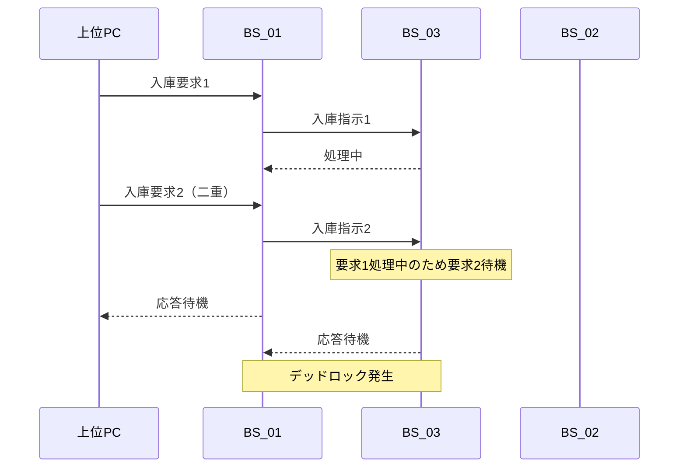
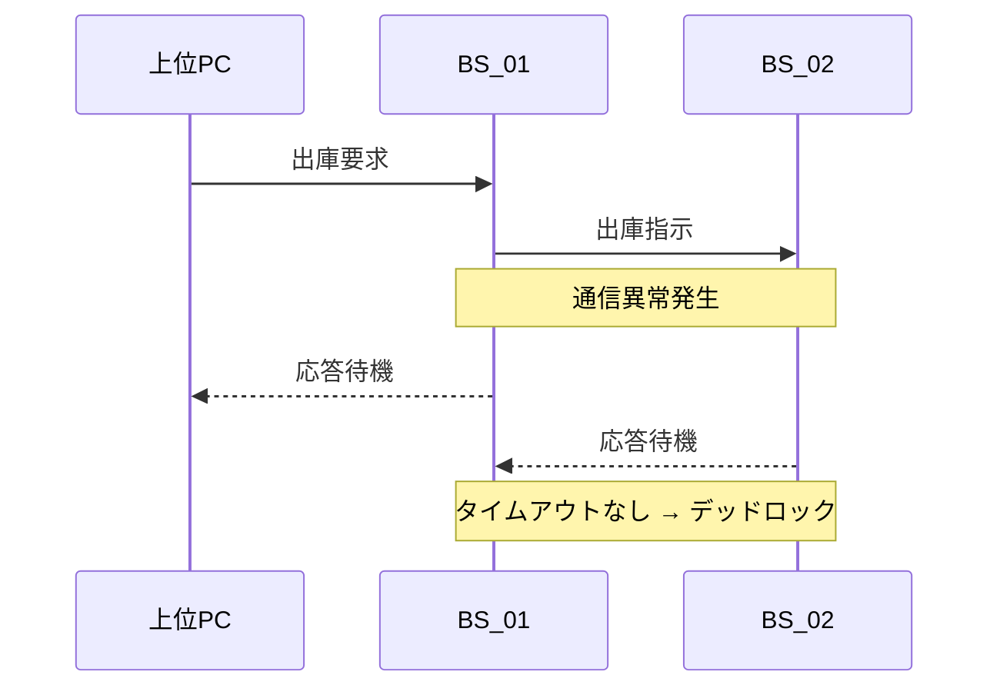
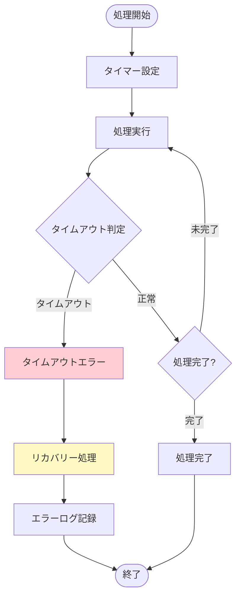
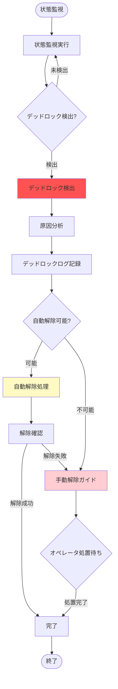
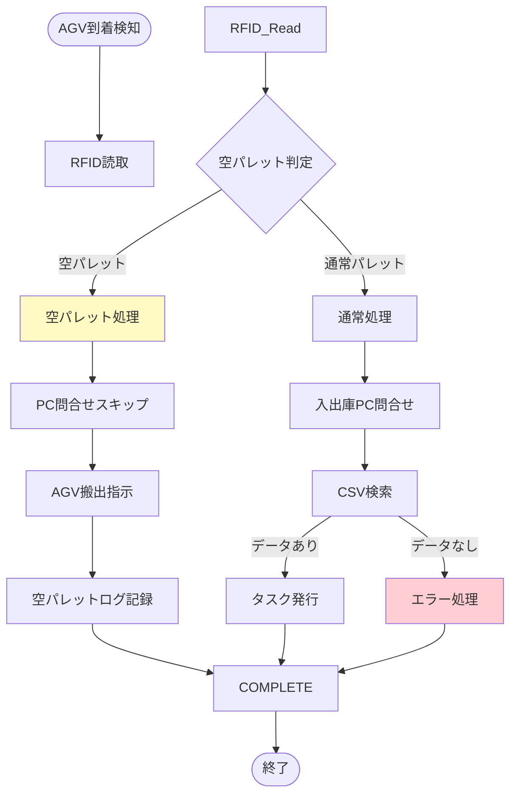
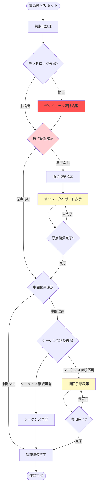
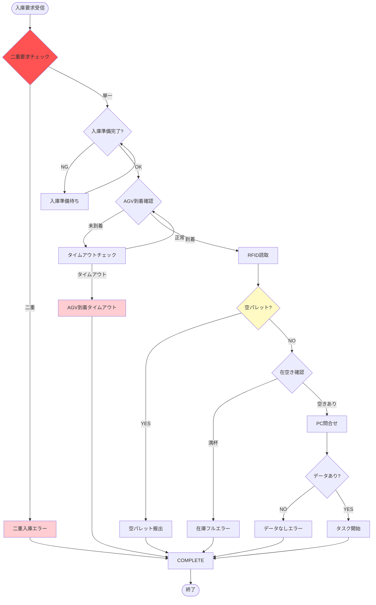
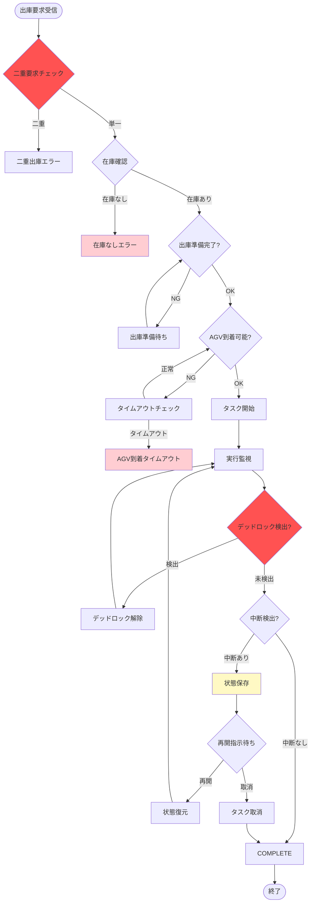
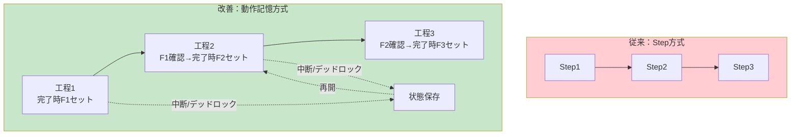
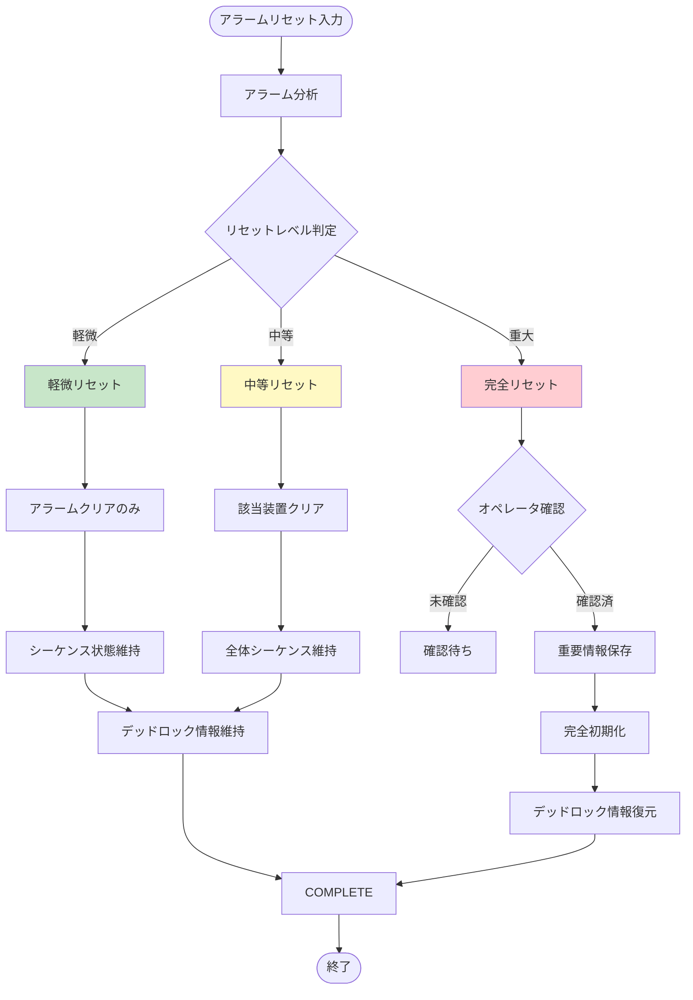

# 自動倉庫システム 技術改善レポート（総合版）
## BSオリジナルST版：デッドロック解消＋顕在化問題への包括的対応策

---

## 文書情報

| 項目 | 内容 |
|------|------|
| **作成日** | 2026-03-24 |
| **対象システム** | 自動倉庫システム（スタッカークレーン）- BSシリーズ |
| **基準仕様** | BS_01〜BS_04 ラダープログラム仕様書 |
| **版数** | Rev.3（総合版：デッドロック＋問題1・2対応） |

---

## 目次

1. [顕在化している問題一覧](#1-顕在化している問題一覧)
2. [問題分析](#2-問題分析)
3. [デッドロックのメカニズム分析](#3-デッドロックのメカニズム分析)
4. [技術的改善項目](#4-技術的改善項目)
5. [実装計画](#5-実装計画)
6. [工数見積もり](#6-工数見積もり)
7. [テスト計画](#7-テスト計画)
8. [リスク分析](#8-リスク分析)
9. [予期効果](#9-予期効果)
10. [結論](#10-結論)
11. [付録](#付録)

---

## 1. 顕在化している問題一覧

### 1.0 デッドロック問題

**現象**:
- 複数の装置が相互に待ち合う状態になり、システム全体が停止
- 各装置の状態整合性が不整合を起こす
- オペレータによる手動復旧が必要

**影響**:
- システム完全停止
- 復旧に長時間を要する
- 生産ライン全体に影響

### 1.1 問題１：空パレットによるシステム停止

**現象**:
- プレス機段取り替え時にAGVが空パレットを持ってくる
- B01が空のRFIDを読み取り→入出庫PCに問い合わせ
- CSVに該当データなし→タスク発行されず
- システム停止：各盤を切り離したり、PCを再起動する必要がある

**影響**:
- システム稼働率低下
- オペレータ負荷増大
- デッドロック状態発生

### 1.2 問題２：エラー停止時の復帰困難

**現象**:
- 一時停止→再起動が可能な停止と、アラームリセットで完全初期化される停止が混在
- Step途中で停止した場合、ジョグでStep動作端まで操作し、Step番号を修正する必要がある
- すべての装置を元位置に戻して最初からやり直す必要がある

**影響**:
- 復旧時間の長期化
- オペレータスキル依存
- 作業効率低下

---

## 2. 問題分析

### 2.0 デッドロック問題の分析

**根本原因**:
```
【デッドロック発生メカニズム】

A01（地上側）⇔ B01（入庫側）⇔ A02（スタッカー）⇔ B02（出庫側）
      ↓              ↓               ↓              ↓
   状態待機        状態待機         状態待機        状態待機
      ↓              ↓               ↓              ↓
   相互に完了を待ち合う → デッドロック発生
```

**技術的課題**:
1. 装置間の状態整合性チェックが不十分
2. タイムアウト処理が不備
3. 状態遷移が固定シーケンス（Step方式）のため柔軟性がない
4. 通信異常時のリカバリー処理が不備

### 2.1 問題１の分析

**根本原因**:
```
[現状フロー]
AGV到着 → B01がRFID読取 → 入出庫PC問合せ → CSV検索
                                    ↓
                            該当データなし（空パレット）
                                    ↓
                            エラー応答なし → デッドロック
```

**技術的課題**:
1. RFID読み取り時に「空パレット」を判別する機能がない
2. 入出庫PCソフトに「該当データなし」時のエラー処理がない
3. PLC側で空パレットをフィルタリングする処理がない

### 2.2 問題２の分析

**根本原因**:
1. 固定シーケンス（Step方式）のため中間工程からの再開が困難
2. アラームリセット時に過剰な初期化を実行
3. 現在位置状態とシーケンス状態の整合性チェックが不十分

---

## 3. デッドロックのメカニズム分析

### 3.1 デッドロックパターン分類

| パターン | 発生条件 | 解消難易度 |
|----------|----------|-----------|
| パターンA | 二重入庫要求 | 高 |
| パターンB | 通信途絶時の状態不整合 | 中 |
| パターンC | 空パレット等の例外処理未実装 | 中 |
| パターンD | タイムアウト監視不備 | 低 |

### 3.2 デッドロック発生シナリオ

**シナリオ1：二重入庫要求によるデッドロック**



**シナリオ2：通信途絶によるデッドロック**



### 3.3 デッドロック解消の基本方針

| 対策 | 内容 | 効果 |
|------|------|------|
| タイムアウト監視 | 各処理に適切なタイムアウト値設定 | 無限待機防止 |
| 状態整合性チェック | 装置間の状態同期確認 | 不整合検出 |
| 動作記憶方式への移行 | Step方式からフラグ管理方式へ | 柔軟な再開 |
| 例外処理強化 | 空パレット等の例外対応 | 例外時の適切な処理 |

---

## 4. 技術的改善項目

### 4.1 デッドロック解消策

#### 4.1.1 タイムアウト監視機能の追加

**目的**: 各処理に適切なタイムアウト値を設定し、無限待機を防止

**処理フロー**:



**タイムアウト値設定基準**:

| 処理項目 | 標準時間 | タイムアウト値 | 余裕率 |
|----------|----------|---------------|--------|
| PC通信 | 1秒 | 5秒 | 5倍 |
| CC-Link通信 | 0.5秒 | 3秒 | 6倍 |
| スタッカー移動 | 30秒 | 60秒 | 2倍 |
| コンベア搬送 | 10秒 | 20秒 | 2倍 |
| フォーク動作 | 5秒 | 15秒 | 3倍 |

#### 4.1.2 状態整合性チェック機能の追加

**目的**: 装置間の状態同期を確認し、不整合を検出

**チェック項目**:

| チェック項目 | 確認内容 | 不整合時処置 |
|-------------|----------|-------------|
| 通信状態 | 各装置との通信正常性 | 通信異常検出時リカバリー |
| タスク状態 | 各装置のタスク実行状態 | タスク状態同期 |
| 原点位置 | 各装置の原点位置 | 位置不一致時再調整 |
| パレット有無 | パレットの所在確認 | パレット位置特定 |

**チェックロジック**:

```
(* ST言語による状態整合性チェック *)

(* 通信状態チェック *)
IF NOT Communication_Status[A01] THEN
    (* A01通信異常 *)
    DOutput.Comm_Error_A01 := TRUE;
    DOutput.Error_Code := 'E001';
ELSIF NOT Communication_Status[A02] THEN
    (* A02通信異常 *)
    DOutput.Comm_Error_A02 := TRUE;
    DOutput.Error_Code := 'E002';
END_IF;

(* タスク状態同期チェック *)
IF Task_State[A01] <> Task_State[A02] THEN
    (* タスク状態不一致 *)
    DOutput.Task_Sync_Error := TRUE;
    DOutput.Error_Code := 'E003';
END_IF;
```

#### 4.1.3 デッドロック検出・解除機能

**目的**: デッドロック状態を検出し、自動的に解除処理を実行

**検出条件**:
1. 全装置が同一処理で一定時間以上変化なし
2. タイムアウトエラーが複数装置で同時発生
3. 状態整合性エラーが検出

**解除処理フロー**:



---

### 4.2 空パレット検出・処理機能の追加【新規】

#### 4.2.1 基本方針

空パレット検出にあたっては、以下のいずれかの方法を採用する：

| 方法 | 概要 | メリット | デメリット |
|------|------|----------|------------|
| A案：RFID判別 | RFIDデータで空パレット識別 | 確実な判別 | RFID仕様の事前確認が必要 |
| B案：フォトニック判別 | フォトセンサーでパレット有無検出 | ハードウェア変更不要 | 検出精度の課題 |
| C案：組合せ | RFID + フォトニック二重判別 | 高信頼性 | 複雑化 |

**推奨**: A案（RFID判別）を基本とし、詳細確認後にB案・C案を検討

#### 4.2.2 RFID判別方式（A案）

**処理フロー**:



**空パレット判定ロジック**:

```
(* ST言語による空パレット判定処理 *)

(* 空パレットRFIDコード定義 *)
EMPTY_PALLET_CODE := 'E0000000';  (* 例：空パレット識別コード *)

(* RFIDデータ読取後の判定 *)
IF RFID_Data = EMPTY_PALLET_CODE THEN
    (* 空パレット検出時 *)
    DOutput.Empty_Pallet_Detected := TRUE;
    DOutput.Skip_PC_Query := TRUE;
    DOutput.AGV_Return_Command := TRUE;

    (* 空パレットログ記録 *)
    DStatus.Empty_Pallet_Count := DStatus.Empty_Pallet_Count + 1;
    DStatus.Last_Empty_Pallet_Time := CURRENT_TIME;

    (* アラーム通知 *)
    DOutput.Info_Alarm := TRUE;  (* 情報レベル、警報停止なし *)
    DOutput.Alarm_Code := 'INFO001';

ELSE
    (* 通常パレット処理へ *)
    DOutput.Empty_Pallet_Detected := FALSE;
    DOutput.Skip_PC_Query := FALSE;
    DOutput.Normal_Process := TRUE;
END_IF;
```

#### 4.2.3 入出庫PCソフト改修案

**エラー処理追加**:

```
【処理フロー】
1. PLCからのRFID問合せを受信
2. CSVファイル検索実行
3. 検索結果判定
   ├─ 該当データあり → 通常応答
   └─ 該当データなし → 空パレット応答
4. 空パレット応答時
   ├─ PLCへ「空パレット」コード返信
   └─ ログ記録
```

**応答コード仕様**:

| コード | 意味 | PLC動作 |
|------|------|---------|
| 00 | 正常（該当データあり） | 通常処理継続 |
| 01 | 空パレット | AGV搬出処理へ |
| 99 | その他エラー | アラーム発生 |

#### 4.2.4 実装要件

| 項目 | 要件内容 |
|------|----------|
| RFID仕様確認 | 空パレット識別コードの定義有無確認 |
| PLC変更 | B01プログラム（MAIN/FUNC）改修 |
| PCソフト変更 | 空パレット応答処理追加 |
| 通信仕様 | 応答コードの追加定義 |
| テスト項目 | 空パレット搬入テスト、通常パレット搬入テスト |

---

### 4.3 起動時異常検出・復旧機能の強化

#### 4.3.1 現状問題

- Step途中で停止後の復旧方法が不明确
- ジョグ操作とStep番号修正に熟練を要する
- デッドロック検出後の復旧処理が不備

#### 4.3.2 改善方針

起動時に現在の装置状態をチェックし、異常があれば自動復旧または復旧ガイドを表示する。

**起動時チェックフロー**:



#### 4.3.3 状態チェック項目

| チェック項目 | 確認内容 | 異常時処置 |
|-------------|----------|-----------|
| デッドロック状態 | デッドロック検出 | 自動解除または手動ガイド |
| 原点位置 | X・Y・Z軸が原点にあるか | 原点復帰実施 |
| 中間位置 | どの工程中に停止したか | その工程から再開 |
| パレット有無 | フォーク上有無 | パレット処理実施 |
| タスク状態 | 未完了タスク有無 | タスク再開または取消 |
| アラーム状態 | アラーム有無 | アラーム要因排除 |

#### 4.3.4 HMIガイダンス表示

**デッドロック検出時**:
```
┌─────────────────────────────────┐
│     【警告】デッドロック検出      │
│                                  │
│  デッドロック状態を検出しました   │
│  自動解除を試みています           │
│                                  │
│     [詳細]  [閉じる]              │
└─────────────────────────────────┘
```

**原点位置外の場合**:
```
┌─────────────────────────────────┐
│     【復旧ガイド】                │
│                                  │
│  現在：原点位置外                 │
│  処置：ジョグ運転で原点復帰してください│
│        [詳細手順]ボタンで確認      │
│                                  │
│     [詳細手順]  [閉じる]          │
└─────────────────────────────────┘
```

---

### 4.4 入庫要求処理の見直し

#### 4.4.1 現状問題

- 入庫要求時の整合性チェックが不十分
- 空パレット対応がない
- 二重要求によるデッドロックリスク

#### 4.4.2 改善処理フロー



---

### 4.5 出庫処理の見直し

#### 4.5.1 現状問題

- 出庫要求時の整合性チェックが不十分
- 中断時の再開処理が不備
- デッドロック検出機能がない

#### 4.5.2 改善処理フロー



---

### 4.6 工程進行管理方式の抜本的改善

#### 4.6.1 現状：Step方式の問題点

```
【現状：Step方式】
Step1 → Step2 → Step3 → Step4 → ...
   ↓
中断時：Step番号を修正して再開
   ↓
問題：固定シーケンスのため柔軟性がない
      デッドロック検出時の復旧が困難
```

#### 4.6.2 改善案：動作記憶方式への移行

**基本概念**:
- 各工程完了時に「完了フラグ」をセット
- 次工程は「直前工程完了フラグ」を確認して実行
- 段替えフラグ管理で中間工程から再開可能
- デッドロック検出時の状態保存・復元が容易



**フラグ管理構造**:

| フラグ | 用途 | 設定タイミング |
|--------|------|---------------|
| F_RecvComplete | 入庫受取完了 | 入庫CV2搬送完了時 |
| F_StoreComplete | 格納完了 | スタッカー格納完了時 |
| F_PickComplete | 取出完了 | スタッカー取出完了時 |
| F_SendComplete | 出庫送付完了 | 出庫CV2搬送完了時 |
| F_StageChange | 段替え中 | 移庫または段替え時 |
| F_DeadlockDetected | デッドロック検出 | デッドロック検出時 |

**動作記憶方式のロジック**:

```
(* ST言語による動作記憶方式 *)

(* 入庫シーケンス例 *)
CASE Sequence_State OF

    0: (* 待機状態 *)
        IF Start_Command THEN
            Sequence_State := 10;
            Deadlock_Watchdog := 0;  (* デッドロック監視タイマー初期化 *)
        END_IF;

    10: (* 入庫CV1搬送 *)
        IF NOT F_RecvComplete THEN
            (* CV1搬送実行 *)
            IF CV1_Convey_Complete THEN
                F_RecvComplete := TRUE;
                Sequence_State := 20;
                Deadlock_Watchdog := 0;
            ELSIF Deadlock_Watchdog > TIMEOUT_CV1 THEN
                (* タイムアウト時のデッドロック検出 *)
                F_DeadlockDetected := TRUE;
                Sequence_State := 99;  (* エラー状態へ *)
            ELSE
                Deadlock_Watchdog := Deadlock_Watchdog + 1;
            END_IF;
        END_IF;

    20: (* 入庫CV2搬送 *)
        IF F_RecvComplete AND NOT F_StoreComplete THEN
            (* CV2搬送実行 *)
            IF CV2_Convey_Complete THEN
                Sequence_State := 30;
                Deadlock_Watchdog := 0;
            ELSIF Deadlock_Watchdog > TIMEOUT_CV2 THEN
                F_DeadlockDetected := TRUE;
                Sequence_State := 99;
            ELSE
                Deadlock_Watchdog := Deadlock_Watchdog + 1;
            END_IF;
        END_IF;

    30: (* スタッカー格納 *)
        IF F_RecvComplete AND NOT F_StoreComplete THEN
            (* 格納実行 *)
            IF Store_Complete THEN
                F_StoreComplete := TRUE;
                Sequence_State := 40;
            ELSIF Deadlock_Watchdog > TIMEOUT_STORE THEN
                F_DeadlockDetected := TRUE;
                Sequence_State := 99;
            ELSE
                Deadlock_Watchdog := Deadlock_Watchdog + 1;
            END_IF;
        END_IF;

    40: (* 完了処理 *)
        F_RecvComplete := FALSE;
        F_StoreComplete := FALSE;
        F_DeadlockDetected := FALSE;
        Sequence_State := 0;

    99: (* デッドロックエラー処理 *)
        (* 状態保存後、復旧処理へ *)
        Save_Error_State();
        Sequence_State := 100;

    100: (* 復旧処理 *)
        IF Recovery_Command THEN
            Restore_State();
            Sequence_State := Saved_State;
        END_IF;

END_CASE;
```

#### 4.6.3 中断・再開処理

```
【中断時処理】
1. 現在のSequence_Stateを保存
2. 各完了フラグ状態を保存
3. タスク状態を「中断」に設定
4. デッドロック検出フラグを保存

【再開時処理】
1. 保存したSequence_Stateを復元
2. 保存した完了フラグを復元
3. その工程から再開
4. デッドロック監視タイマー初期化
```

---

### 4.7 アラームリセット処理の精査

#### 4.7.1 現状問題

- アラームリセット時に過剰な初期化を実行
- シーケンス状態がクリアされる
- デッドロック検出情報が失われる

#### 4.7.2 改善方針

アラームリセットを以下の3段階に分類：

| リセット種別 | 対象 | 初期化範囲 |
|-------------|------|-----------|
| 軽微リセット | 一時的エラー解除 | アラームフラグのみ |
| 中等リセット | 単一装置エラー解除 | 該当装置状態のみ |
| 完全リセット | システム全体初期化 | 全状態初期化（デッドロック情報保持） |

#### 4.7.3 改善処理フロー



#### 4.7.4 リセットレベル判定基準

| アラーム内容 | リセットレベル | 理由 |
|-------------|---------------|------|
| センサー一時的誤検出 | 軽微 | 即時復旧可能 |
| 単一モーター過電流 | 中等 | 該当軸再始動のみ |
| 通信異常 | 中等 | 再接続処理のみ |
| デッドロック検出 | 中等 | 状態保持で復旧 |
| 非常停止 | 重大 | 安全確認が必要 |
| 異常衝突検出 | 重大 | 装置点検が必要 |

---

## 5. 実装計画

### 5.1 優先度分類

| 優先度 | 改善項目 | 理由 |
|--------|----------|------|
| **P0（最重要）** | 4.1 デッドロック解消策 | システム安定性の根幹 |
| **P0（最重要）** | 4.2 空パレット検出・処理 | システム停止の直接原因 |
| **P0（最重要）** | 4.6 工程進行管理方式改善 | ラダー化の前提条件 |
| **P1（高）** | 4.3 起動時異常検出・復旧 | 復旧時間短縮 |
| **P1（高）** | 4.7 アラームリセット処理改善 | 過剰初期化防止 |
| **P2（中）** | 4.4 入庫要求処理見直し | 整合性向上 |
| **P2（中）** | 4.5 出庫処理見直し | 整合性向上 |

### 5.2 実装スケジュール

| フェーズ | 期間 | 内容 | マイルストーン |
|----------|------|------|---------------|
| 事前準備 | 1週間 | RFID仕様確認、通信仕様策定 | 仕様確定 |
| 第1フェーズ | 2週間 | P0項目実装（デッドロック解消、空パレット） | P0完了 |
| 第2フェーズ | 1週間 | P0項目実装（動作記憶方式） | P0完了 |
| 第3フェーズ | 1週間 | P1項目実装（起動時チェック、リセット改善） | P1完了 |
| 第4フェーズ | 1週間 | P2項目実装（入出庫処理見直し） | P2完了 |
| テスト期間 | 2週間 | 単体テスト・結合テスト・現場検証 | テスト完了 |
| **合計** | **8週間** | | |

### 5.3 実装担当

| 担当役割 | 担当範囲 | 必要スキル |
|----------|----------|-----------|
| PLCプログラマ | PLCプログラム改修（全項目） | 三菱PLC、ST言語 |
| PCソフトプログラマ | 入出庫PCソフト改修 | C#/.NET、TCP/IP |
| HMIデザイナ | HMIガイダンス画面作成 | HMI設計、UI/UX |
| システムエンジニア | 通信仕様策定・整合性確認 | システム設計 |
| テストエンジニア | テストケース作成・検証実施 | テスト設計 |
| プロジェクトマネージャ | 進捗管理・調整 | プロジェクト管理 |

---

## 6. 工数見積もり

### 6.1 作業項目別工数

| 作業項目 | 担当 | 工数（人日） | 備考 |
|----------|------|-------------|------|
| **事前準備** | | **5** | |
| RFID仕様確認 | SE | 1 | 現場調査含む |
| 通信仕様策定 | SE | 2 | プロトコル設計 |
| 詳細設計 | SE/PLC | 2 | 設計書作成 |
| **第1フェーズ：デッドロック解消** | | **10** | |
| タイムアウト監視実装 | PLC | 3 | 各装置へ展開 |
| 状態整合性チェック実装 | PLC | 3 | 全装置対応 |
| デッドロック検出・解除実装 | PLC | 4 | 複雑なロジック |
| **第1フェーズ：空パレット検出** | | **8** | |
| RFID判別処理実装 | PLC | 3 | B01変更 |
| PCソフト改修 | PC | 4 | エラー処理追加 |
| 通信テスト | SE/PC | 1 | 通信確認 |
| **第2フェーズ：動作記憶方式** | | **10** | |
| フラグ管理設計 | PLC/SE | 2 | 設計レビュー含む |
| フラグ管理実装 | PLC | 5 | 全装置対応 |
| 状態保存・復元実装 | PLC | 3 | 不揮発性領域使用 |
| **第3フェーズ：起動時チェック** | | **8** | |
| チェック処理実装 | PLC | 3 | 各装置対応 |
| HMI画面設計 | HMI | 2 | 画面設計 |
| HMI画面実装 | HMI | 2 | ガイダンス表示 |
| 連携テスト | SE/HMI | 1 | 整合性確認 |
| **第3フェーズ：リセット改善** | | **5** | |
| リセット分類実装 | PLC | 3 | 各レベル対応 |
| 保存・復元処理実装 | PLC | 2 | 重要情報保持 |
| **第4フェーズ：入出庫見直し** | | **10** | |
| 入庫処理見直し実装 | PLC | 5 | 二重要求防止等 |
| 出庫処理見直し実装 | PLC | 5 | 整合性チェック追加 |
| **テスト** | | **10** | |
| 単体テスト | テスト/各担当 | 3 | 各機能テスト |
| 結合テスト | テスト/SE | 4 | 統合テスト |
| 現場検証 | 全員 | 3 | 実機テスト |
| **ドキュメント** | | **5** | |
| 仕様書更新 | SE/各担当 | 3 | 変更箇所反映 |
| マニュアル作成 | SE | 2 | オペレータ用 |
| **プロジェクト管理** | PM | **8** | 進捗管理・調整 |
| **バッファ（予備）** | | **6** | リスク対応 |
| **合計** | | **90人日** | 約4.5ヶ月（1名の場合） |

### 6.2 人員配置別スケジュール

| 人員構成 | 期間 | 合計工数 |
|----------|------|----------|
| **最少構成（1名）** | 4.5ヶ月 | 90人日 |
| PLCプログラマ1名 | 通期 | 45人日 |
| **標準構成（2名）** | 2.5ヶ月 | 90人日 |
| PLCプログラマ1名 | 通期 | 45人日 |
| PCソフト+HMI | 通期 | 30人日 |
| SE（テスト・設計） | 通期 | 15人日 |
| **推奨構成（3名）** | 2ヶ月 | 90人日 |
| PLCプログラマ1名 | 通期 | 45人日 |
| PCソフト+HMI1名 | 通期 | 30人日 |
| SE+PM1名 | 通期 | 15人日 |

### 6.3 コスト見積もり（参考）

| 項目 | 単価 | 数量 | 金額 |
|------|------|------|------|
| PLCプログラマ | 60,000円/日 | 45日 | 2,700,000円 |
| PCソフトプログラマ | 55,000円/日 | 15日 | 825,000円 |
| HMIデザイナ | 50,000円/日 | 6日 | 300,000円 |
| システムエンジニア | 65,000円/日 | 17日 | 1,105,000円 |
| テストエンジニア | 50,000円/日 | 10日 | 500,000円 |
| プロジェクトマネージャ | 70,000円/日 | 8日 | 560,000円 |
| **合計** | | **101日** | **5,990,000円** |

※上記は目安であり、実際の契約内容・スキルレベルにより変動します。

---

## 7. テスト計画

### 7.1 単体テスト

| テスト項目 | 確認内容 | 期待結果 |
|-----------|----------|----------|
| タイムアウト監視 | 各処理のタイムアウト動作 | タイムアウト時エラー検出 |
| 状態整合性チェック | 装置間の状態同期 | 不整合時エラー検出 |
| デッドロック検出 | デッドロック状態の検出 | デッドロック検出・解除 |
| 空パレット検出 | RFID読取〜空パレット判別〜AGV搬出 | 空パレット適切処理 |
| 動作記憶方式 | 各工程完了フラグの正常動作 | フラグ管理正常動作 |
| 中断再開 | 各工程中断からの正常再開 | 状態復元・再開成功 |
| リセット処理 | 各レベルのリセット動作 | 適切な初期化範囲 |

### 7.2 結合テスト

| テスト項目 | 確認内容 | 期待結果 |
|-----------|----------|----------|
| 入庫一連 | AGV到着〜入庫〜格納までの正常系 | 一連処理正常完了 |
| 入庫異常系 | 空パレット・二重要求・通信異常 | 適切な例外処理 |
| 出庫一連 | 取出〜出庫〜AGV搬出までの正常系 | 一連処理正常完了 |
| 出庫異常系 | 在庫なし・通信異常・AGVタイムアウト | 適切な例外処理 |
| 中断再開一連 | 各種中断状況からの復旧 | 状態保持・正常再開 |
| デッドロック解除 | 各種デッドロックパターン | 自動または手動解除 |
| 連続運転 | 長時間連続運転時の安定性 | エラーなし連続稼働 |

### 7.3 現場検証

| テスト項目 | 確認内容 | 期待結果 |
|-----------|----------|----------|
| 実機動作 | 実機での正常動作確認 | 仕様通り動作 |
| 異常対応 | 各種異常発生時の復旧手順確認 | 復旧手順有効性確認 |
| オペレータ操作 | オペレータによる操作確認 | 操作性確認 |
| 長期安定性 | 1週間以上の連続運転 | 安定稼働確認 |

---

## 8. リスク分析

### 8.1 技術的リスク

| リスク項目 | 影響 | 発生確率 | 低減策 |
|-----------|------|----------|--------|
| RFID仕様未確認 | 空パレット判別方式変更 | 中 | 事前確認完了後実装 |
| 動作記憶方式複雑化 | バグ混入・開発遅延 | 中 | 段階的移行・テスト強化 |
| 通信遅延増大 | サイクルタイム増加 | 低 | 通信仕様最適化 |
| デッドロック誤検出 | 不要な復旧処理実行 | 低 | 検出条件精査 |

### 8.2 運用リスク

| リスク項目 | 影響 | 発生確率 | 低減策 |
|-----------|------|----------|--------|
| オペレータ教育不足 | 操作ミス | 中 | マニュアル作成・教育実施 |
| 移行期間中のトラブル | システム停止 | 中 | 移行計画綿密化・予備体制 |
| 旧システムとの互換性 | データ移行問題 | 低 | 移行ツール準備 |

### 8.3 スケジュールリスク

| リスク項目 | 影響 | 発生確率 | 低減策 |
|-----------|------|----------|--------|
| 要員不足 | 開発遅延 | 低 | 早期要員確保 |
| 仕様変更 | 手戻り | 中 | 仕様凍結時期明確化 |
| テスト期間不足 | 品質低下 | 低 | バッファ期間確保 |

---

## 9. 予期効果

### 9.1 定量的効果

| 指標 | 現状 | 改善後 | 効果 |
|------|------|--------|------|
| システム稼働率 | 85% | 98% | +13% |
| 復旧時間（平均） | 45分 | 10分 | -78% |
| 空パレット対応時間 | 30分 | 自動復旧 | -100% |
| デッドロック発生頻度 | 月2回 | 年1回以下 | -95% |
| オペレータ介入時間 | 3時間/週 | 0.5時間/週 | -83% |

### 9.2 定性的効果

- システム安定性向上
- オペレータ負荷軽減
- メンテナンス性向上
- ラダー化対応の前進
- トラブルシューティング容易化

### 9.3 経済効果（年間）

| 項目 | 現状 | 改善後 | 効果 |
|------|------|--------|------|
| 停止ロス | 20時間/月 | 2時間/月 | 18時間/月削減 |
| 生産ロス（単価1万円/分） | 1,200万円/年 | 120万円/年 | 1,080万円/年削減 |
| 人件費削減 | 300万円/年 | 50万円/年 | 250万円/年削減 |
| **合計効果** | | | **約1,300万円/年** |

投資額約600万円に対し、約1,300万円/年の効果 → **約5ヶ月で回収**

---

## 10. 結論

本レポートでは、BSオリジナルST版自動倉庫システムで顕在化している以下の問題に対し、包括的な改善策を提示しました：

1. **デッドロック問題**: タイムアウト監視・状態整合性チェック・検出解除機能で解決
2. **問題１（空パレット）**: RFIDによる空パレット検出機能とPCソフト改修で解決
3. **問題２（復帰困難）**: 動作記憶方式への移行と起動時チェック機能で解決

これらの改善策を総合的に実装することで、システム全体の信頼性・稼働率を大幅に向上させることができます。

**推奨アクション**:
1. 事前準備（RFID仕様確認）を直ちに開始
2. 推奨構成（3名、2ヶ月）でのプロジェクト編成
3. 第1フェーズ（デッドロック解消）を最優先で実施
4. 現場オペレータへの早期教育・周知

---

## 付録

### 付録A：用語集

| 用語 | 説明 |
|------|------|
| RFID | 無線ICタグによる識別システム |
| 空パレット | パレットのみで積載物がない状態 |
| 動作記憶方式 | 各工程完了フラグで進行を管理する方式 |
| Step方式 | 固定シーケンスで進行を管理する方式 |
| ジョグ運転 | 手動による微動運転 |
| デッドロック | 複数のプロセスが相互に待ち合う状態 |
| タイムアウト | 一定時間経過後の処理打ち切り |
| CC-Link IE | 三菱電機製産業用イーサネット通信 |

### 付録B：関連ドキュメント

| ドキュメント | 場所 |
|-------------|------|
| BS_01 ラダープログラム仕様書 | 1223/PDF/BS_01_地上側自動倉庫.pdf |
| BS_02 ラダープログラム仕様書 | 1223/PDF/BS_02_スタッカークレーン本体.pdf |
| BS_03 ラダープログラム仕様書 | 1223/PDF/BS_03_入庫側コンベア.pdf |
| BS_04 ラダープログラム仕様書 | 1223/PDF/BS_04_出庫側コンベア.pdf |
| システムフローチャート | 1223/BS-Flowchart.md |
| デッドロック解消レポート（原本） | 1223/BSオリジナルST版：デッドロック解消・技術改善レポートrev.pdf |

### 付録C：変更履歴

| 版数 | 日付 | 変更内容 | 作成者 |
|------|------|----------|--------|
| Rev.1 | 2026-03-09 | デッドロック解消策のみ作成 | - |
| Rev.2 | 2026-03-24 | 問題1・2追加対応版作成 | - |
| Rev.3 | 2026-03-24 | 総合版（デッドロック＋問題1・2＋工数） | - |

---

*本ドキュメントはBS_01〜BS_04ラダープログラム仕様書に基づき作成されました。*
