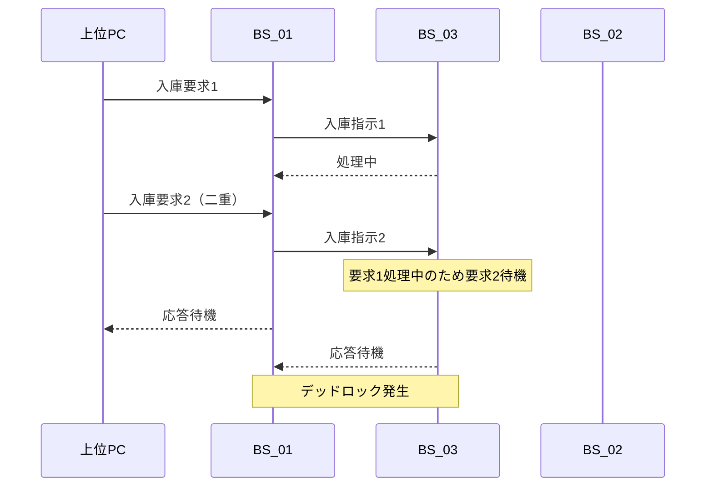

# 自動倉庫システム 技術改善レポート（総合版）
## BSオリジナルST版：デッドロック解消＋顕在化問題への包括的対応策
### ＋AI活用時の工数分析

---

## 文書情報

| 項目 | 内容 |
|------|------|
| **作成日** | 2026-03-24 |
| **対象システム** | 自動倉庫システム（スタッカークレーン）- BSシリーズ |
| **基準仕様** | BS_01〜BS_04 ラダープログラム仕様書 |
| **版数** | Rev.4（総合版：デッドロック＋問題1・2対応＋AI活用工数分析） |

---

## 目次

1. [顕在化している問題一覧](#1-顕在化している問題一覧)
2. [問題分析](#2-問題分析)
3. [デッドロックのメカニズム分析](#3-デッドロックのメカニズム分析)
4. [技術的改善項目](#4-技術的改善項目)
5. [実装計画](#5-実装計画)
6. [工数見積もり](#6-工数見積もり)
7. [AI活用時の工数削減分析](#7-ai活用時の工数削減分析)
8. [テスト計画](#8-テスト計画)
9. [リスク分析](#9-リスク分析)
10. [予期効果](#10-予期効果)
11. [結論](#11-結論)
12. [付録](#付録)

---

## 1. 顕在化している問題一覧

### 1.0 デッドロック問題

**現象**:
- 複数の装置が相互に待ち合う状態になり、システム全体が停止
- 各装置の状態整合性が不整合を起こす
- オペレータによる手動復旧が必要

**影響**:
- システム完全停止
- 復旧に長時間を要する
- 生産ライン全体に影響

### 1.1 問題１：空パレットによるシステム停止

**現象**:
- プレス機段取り替え時にAGVが空パレットを持ってくる
- B01が空のRFIDを読み取り→入出庫PCに問い合わせ
- CSVに該当データなし→タスク発行されず
- システム停止：各盤を切り離したり、PCを再起動する必要がある

**影響**:
- システム稼働率低下
- オペレータ負荷増大
- デッドロック状態発生

### 1.2 問題２：エラー停止時の復帰困難

**現象**:
- 一時停止→再起動が可能な停止と、アラームリセットで完全初期化される停止が混在
- Step途中で停止した場合、ジョグでStep動作端まで操作し、Step番号を修正する必要がある
- すべての装置を元位置に戻して最初からやり直す必要がある

**影響**:
- 復旧時間の長期化
- オペレータスキル依存
- 作業効率低下

---

## 2. 問題分析

### 2.0 デッドロック問題の分析

**根本原因**:
```
【デッドロック発生メカニズム】

A01（地上側）⇔ B01（入庫側）⇔ A02（スタッカー）⇔ B02（出庫側）
      ↓              ↓               ↓              ↓
   状態待機        状態待機         状態待機        状態待機
      ↓              ↓               ↓              ↓
   相互に完了を待ち合う → デッドロック発生
```

**技術的課題**:
1. 装置間の状態整合性チェックが不十分
2. タイムアウト処理が不備
3. 状態遷移が固定シーケンス（Step方式）のため柔軟性がない
4. 通信異常時のリカバリー処理が不備

### 2.1 問題１の分析

**根本原因**:
```
[現状フロー]
AGV到着 → B01がRFID読取 → 入出庫PC問合せ → CSV検索
                                    ↓
                            該当データなし（空パレット）
                                    ↓
                            エラー応答なし → デッドロック
```

**技術的課題**:
1. RFID読み取り時に「空パレット」を判別する機能がない
2. 入出庫PCソフトに「該当データなし」時のエラー処理がない
3. PLC側で空パレットをフィルタリングする処理がない

### 2.2 問題２の分析

**根本原因**:
1. 固定シーケンス（Step方式）のため中間工程からの再開が困難
2. アラームリセット時に過剰な初期化を実行
3. 現在位置状態とシーケンス状態の整合性チェックが不十分

---

## 3. デッドロックのメカニズム分析

### 3.1 デッドロックパターン分類

| パターン | 発生条件 | 解消難易度 |
|----------|----------|-----------|
| パターンA | 二重入庫要求 | 高 |
| パターンB | 通信途絶時の状態不整合 | 中 |
| パターンC | 空パレット等の例外処理未実装 | 中 |
| パターンD | タイムアウト監視不備 | 低 |

### 3.2 デッドロック発生シナリオ

**シナリオ1：二重入庫要求によるデッドロック**



### 3.3 デッドロック解消の基本方針

| 対策 | 内容 | 効果 |
|------|------|------|
| タイムアウト監視 | 各処理に適切なタイムアウト値設定 | 無限待機防止 |
| 状態整合性チェック | 装置間の状態同期確認 | 不整合検出 |
| 動作記憶方式への移行 | Step方式からフラグ管理方式へ | 柔軟な再開 |
| 例外処理強化 | 空パレット等の例外対応 | 例外時の適切な処理 |

---

## 4. 技術的改善項目

### 4.1 デッドロック解消策

#### 4.1.1 タイムアウト監視機能の追加

**目的**: 各処理に適切なタイムアウト値を設定し、無限待機を防止

**タイムアウト値設定基準**:

| 処理項目 | 標準時間 | タイムアウト値 | 余裕率 |
|----------|----------|---------------|--------|
| PC通信 | 1秒 | 5秒 | 5倍 |
| CC-Link通信 | 0.5秒 | 3秒 | 6倍 |
| スタッカー移動 | 30秒 | 60秒 | 2倍 |
| コンベア搬送 | 10秒 | 20秒 | 2倍 |
| フォーク動作 | 5秒 | 15秒 | 3倍 |

#### 4.1.2 状態整合性チェック機能の追加

**チェック項目**:

| チェック項目 | 確認内容 | 不整合時処置 |
|-------------|----------|-------------|
| 通信状態 | 各装置との通信正常性 | 通信異常検出時リカバリー |
| タスク状態 | 各装置のタスク実行状態 | タスク状態同期 |
| 原点位置 | 各装置の原点位置 | 位置不一致時再調整 |
| パレット有無 | パレットの所在確認 | パレット位置特定 |

#### 4.1.3 デッドロック検出・解除機能

**検出条件**:
1. 全装置が同一処理で一定時間以上変化なし
2. タイムアウトエラーが複数装置で同時発生
3. 状態整合性エラーが検出

---

### 4.2 空パレット検出・処理機能の追加【新規】

#### 4.2.1 RFID判別方式（A案）

**推奨**: A案（RFID判別）を基本とし、詳細確認後にB案・C案を検討

**空パレット判定ロジック**:

```
(* ST言語による空パレット判定処理 *)
EMPTY_PALLET_CODE := 'E0000000';

IF RFID_Data = EMPTY_PALLET_CODE THEN
    DOutput.Empty_Pallet_Detected := TRUE;
    DOutput.Skip_PC_Query := TRUE;
    DOutput.AGV_Return_Command := TRUE;
    DStatus.Empty_Pallet_Count := DStatus.Empty_Pallet_Count + 1;
    DOutput.Info_Alarm := TRUE;
    DOutput.Alarm_Code := 'INFO001';
ELSE
    DOutput.Empty_Pallet_Detected := FALSE;
    DOutput.Normal_Process := TRUE;
END_IF;
```

#### 4.2.2 入出庫PCソフト改修案

**応答コード仕様**:

| コード | 意味 | PLC動作 |
|------|------|---------|
| 00 | 正常（該当データあり） | 通常処理継続 |
| 01 | 空パレット | AGV搬出処理へ |
| 99 | その他エラー | アラーム発生 |

---

### 4.3 起動時異常検出・復旧機能の強化

**状態チェック項目**:

| チェック項目 | 確認内容 | 異常時処置 |
|-------------|----------|-----------|
| デッドロック状態 | デッドロック検出 | 自動解除または手動ガイド |
| 原点位置 | X・Y・Z軸が原点にあるか | 原点復帰実施 |
| 中間位置 | どの工程中に停止したか | その工程から再開 |
| パレット有無 | フォーク上有無 | パレット処理実施 |
| タスク状態 | 未完了タスク有無 | タスク再開または取消 |
| アラーム状態 | アラーム有無 | アラーム要因排除 |

---

### 4.4 入庫要求処理の見直し

改善フローには以下の機能を追加：
- 二重要求チェック
- 空パレット検出
- タイムアウト監視
- 在庫確認

---

### 4.5 出庫処理の見直し

改善フローには以下の機能を追加：
- 二重要求チェック
- デッドロック検出
- 状態保存・復元機能

---

### 4.6 工程進行管理方式の抜本的改善

#### 4.6.1 動作記憶方式への移行

**基本概念**:
- 各工程完了時に「完了フラグ」をセット
- 次工程は「直前工程完了フラグ」を確認して実行
- 段替えフラグ管理で中間工程から再開可能
- デッドロック検出時の状態保存・復元が容易

**フラグ管理構造**:

| フラグ | 用途 | 設定タイミング |
|--------|------|---------------|
| F_RecvComplete | 入庫受取完了 | 入庫CV2搬送完了時 |
| F_StoreComplete | 格納完了 | スタッカー格納完了時 |
| F_PickComplete | 取出完了 | スタッカー取出完了時 |
| F_SendComplete | 出庫送付完了 | 出庫CV2搬送完了時 |
| F_DeadlockDetected | デッドロック検出 | デッドロック検出時 |

---

### 4.7 アラームリセット処理の精査

**リセット種別**:

| リセット種別 | 対象 | 初期化範囲 |
|-------------|------|-----------|
| 軽微リセット | 一時的エラー解除 | アラームフラグのみ |
| 中等リセット | 単一装置エラー解除 | 該当装置状態のみ |
| 完全リセット | システム全体初期化 | 全状態初期化（デッドロック情報保持） |

---

## 5. 実装計画

### 5.1 優先度分類

| 優先度 | 改善項目 | 理由 |
|--------|----------|------|
| **P0（最重要）** | 4.1 デッドロック解消策 | システム安定性の根幹 |
| **P0（最重要）** | 4.2 空パレット検出・処理 | システム停止の直接原因 |
| **P0（最重要）** | 4.6 工程進行管理方式改善 | ラダー化の前提条件 |
| **P1（高）** | 4.3 起動時異常検出・復旧 | 復旧時間短縮 |
| **P1（高）** | 4.7 アラームリセット処理改善 | 過剰初期化防止 |
| **P2（中）** | 4.4 入庫要求処理見直し | 整合性向上 |
| **P2（中）** | 4.5 出庫処理見直し | 整合性向上 |

### 5.2 実装スケジュール（標準）【AI非活用】

| フェーズ | 期間 | 内容 | マイルストーン |
|----------|------|------|---------------|
| 事前準備 | 1週間 | RFID仕様確認、通信仕様策定 | 仕様確定 |
| 第1フェーズ | 2週間 | P0項目実装（デッドロック解消、空パレット） | P0完了 |
| 第2フェーズ | 1週間 | P0項目実装（動作記憶方式） | P0完了 |
| 第3フェーズ | 1週間 | P1項目実装（起動時チェック、リセット改善） | P1完了 |
| 第4フェーズ | 1週間 | P2項目実装（入出庫処理見直し） | P2完了 |
| テスト期間 | 2週間 | 単体テスト・結合テスト・現場検証 | テスト完了 |
| **合計** | **8週間** | | |

### 5.3 実装スケジュール（AI活用時）

| フェーズ | 期間 | 内容 | AI活用による短縮 |
|----------|------|------|-----------------|
| 事前準備 | 1週間 | RFID仕様確認、通信仕様策定 | 変更なし（現場作業） |
| 第1フェーズ | **1週間** | P0項目実装（デッドロック解消、空パレット） | **-1週間** |
| 第2フェーズ | **4日** | P0項目実装（動作記憶方式） | **-3日** |
| 第3フェーズ | **4日** | P1項目実装（起動時チェック、リセット改善） | **-3日** |
| 第4フェーズ | **4日** | P2項目実装（入出庫処理見直し） | **-3日** |
| テスト期間 | **1週間** | 単体テスト・結合テスト・現場検証 | **-1週間** |
| **合計** | **4.5週間** | | **-3.5週間（44%短縮）** |

---

## 6. 工数見積もり

### 6.1 作業項目別工数（標準：AI非活用）

| 作業項目 | 担当 | 工数（人日） | 備考 |
|----------|------|-------------|------|
| **事前準備** | | **5** | |
| RFID仕様確認 | SE | 1 | 現場調査含む |
| 通信仕様策定 | SE | 2 | プロトコル設計 |
| 詳細設計 | SE/PLC | 2 | 設計書作成 |
| **第1フェーズ：デッドロック解消** | | **10** | |
| タイムアウト監視実装 | PLC | 3 | 各装置へ展開 |
| 状態整合性チェック実装 | PLC | 3 | 全装置対応 |
| デッドロック検出・解除実装 | PLC | 4 | 複雑なロジック |
| **第1フェーズ：空パレット検出** | | **8** | |
| RFID判別処理実装 | PLC | 3 | B01変更 |
| PCソフト改修 | PC | 4 | エラー処理追加 |
| 通信テスト | SE/PC | 1 | 通信確認 |
| **第2フェーズ：動作記憶方式** | | **10** | |
| フラグ管理設計 | PLC/SE | 2 | 設計レビュー含む |
| フラグ管理実装 | PLC | 5 | 全装置対応 |
| 状態保存・復元実装 | PLC | 3 | 不揮発性領域使用 |
| **第3フェーズ：起動時チェック** | | **8** | |
| チェック処理実装 | PLC | 3 | 各装置対応 |
| HMI画面設計 | HMI | 2 | 画面設計 |
| HMI画面実装 | HMI | 2 | ガイダンス表示 |
| 連携テスト | SE/HMI | 1 | 整合性確認 |
| **第3フェーズ：リセット改善** | | **5** | |
| リセット分類実装 | PLC | 3 | 各レベル対応 |
| 保存・復元処理実装 | PLC | 2 | 重要情報保持 |
| **第4フェーズ：入出庫見直し** | | **10** | |
| 入庫処理見直し実装 | PLC | 5 | 二重要求防止等 |
| 出庫処理見直し実装 | PLC | 5 | 整合性チェック追加 |
| **テスト** | | **10** | |
| 単体テスト | テスト/各担当 | 3 | 各機能テスト |
| 結合テスト | テスト/SE | 4 | 統合テスト |
| 現場検証 | 全員 | 3 | 実機テスト |
| **ドキュメント** | | **5** | |
| 仕様書更新 | SE/各担当 | 3 | 変更箇所反映 |
| マニュアル作成 | SE | 2 | オペレータ用 |
| **プロジェクト管理** | PM | **8** | 進捗管理・調整 |
| **バッファ（予備）** | | **6** | リスク対応 |
| **合計** | | **90人日** | 約4.5ヶ月（1名の場合） |

### 6.2 人員配置別スケジュール（標準：AI非活用）

| 人員構成 | 期間 | 合計工数 |
|----------|------|----------|
| **最少構成（1名）** | 4.5ヶ月 | 90人日 |
| **標準構成（2名）** | 2.5ヶ月 | 90人日 |
| **推奨構成（3名）** | 2ヶ月 | 90人日 |

### 6.3 コスト見積もり（参考：AI非活用）

| 項目 | 単価 | 数量 | 金額 |
|------|------|------|------|
| PLCプログラマ | 60,000円/日 | 45日 | 2,700,000円 |
| PCソフトプログラマ | 55,000円/日 | 15日 | 825,000円 |
| HMIデザイナ | 50,000円/日 | 6日 | 300,000円 |
| システムエンジニア | 65,000円/日 | 17日 | 1,105,000円 |
| テストエンジニア | 50,000円/日 | 10日 | 500,000円 |
| プロジェクトマネージャ | 70,000円/日 | 8日 | 560,000円 |
| **合計** | | **101日** | **5,990,000円** |

---

## 7. AI活用時の工数削減分析

### 7.1 AIによる工数削減メカニズム

#### 7.1.1 AIが活用できる作業

| 作業分野 | AI活用内容 | 削減率 | 理由 |
|----------|-----------|--------|------|
| **コード生成** | 仕様書からST言語コードを生成 | **60%** | 基本ロジックはAIで生成可能 |
| **デバッグ** | エラー原因分析・修正提案 | **50%** | AIがエラー箇所を特定・修正 |
| **テストケース作成** | テストパターンの自動生成 | **40%** | AIが網羅的なパターンを提案 |
| **ドキュメント作成** | 仕様書・マニュアルの自動生成 | **50%** | コードからコメント・説明を生成 |
| **コードレビュー** | 静的解析・改善提案 | **30%** | AIが品質問題を指摘 |
| **HMI画面設計** | UI案の自動生成 | **30%** | AIがレイアウト案を提案 |

#### 7.1.2 AIが活用できない（または困難な）作業

| 作業分野 | 削減率 | 理由 |
|----------|--------|------|
| **実機確認・調整** | **0%** | 物理的な現場作業が必要 |
| **RFID仕様確認** | **0%** | 現場調査・メーカ確認が必要 |
| **現場特有の問題対応** | **20%** | 実機挙動に基づく調整が必要 |
| **オペレータ教育** | **0%** | 人対人の教育が必要 |
| **プロジェクト管理** | **10%** | 進捗管理・調整は人が行う |
| **現場検証** | **20%** | 実機での検証が主体 |

### 7.2 作業項目別工数（AI活用時）

| 作業項目 | 標準工数 | AI活用工数 | 削減量 | 削減率 | AI活用内容 |
|----------|----------|-----------|--------|--------|-----------|
| **事前準備** | **5** | **4** | -1 | -20% | 仕様書分析支援 |
| RFID仕様確認 | 1 | 1 | 0 | 0% | 現場作業（変更不可） |
| 通信仕様策定 | 2 | 1.5 | -0.5 | -25% | プロトコル設計支援 |
| 詳細設計 | 2 | 1.5 | -0.5 | -25% | 設計書レビュー支援 |
| **第1フェーズ：デッドロック解消** | **10** | **5** | -5 | -50% | コード生成・デバッグ支援 |
| タイムアウト監視実装 | 3 | 1.5 | -1.5 | -50% | コード生成 |
| 状態整合性チェック実装 | 3 | 1.5 | -1.5 | -50% | コード生成 |
| デッドロック検出・解除実装 | 4 | 2 | -2 | -50% | コード生成・レビュー |
| **第1フェーズ：空パレット検出** | **8** | **4** | -4 | -50% | コード生成・デバッグ支援 |
| RFID判別処理実装 | 3 | 1.5 | -1.5 | -50% | コード生成 |
| PCソフト改修 | 4 | 2 | -2 | -50% | コード生成 |
| 通信テスト | 1 | 0.5 | -0.5 | -50% | テスト自動化支援 |
| **第2フェーズ：動作記憶方式** | **10** | **5** | -5 | -50% | コード生成・設計支援 |
| フラグ管理設計 | 2 | 1 | -1 | -50% | 設計支援 |
| フラグ管理実装 | 5 | 2.5 | -2.5 | -50% | コード生成 |
| 状態保存・復元実装 | 3 | 1.5 | -1.5 | -50% | コード生成 |
| **第3フェーズ：起動時チェック** | **8** | **4** | -4 | -50% | コード生成・HMI支援 |
| チェック処理実装 | 3 | 1.5 | -1.5 | -50% | コード生成 |
| HMI画面設計 | 2 | 1.4 | -0.6 | -30% | UI案生成 |
| HMI画面実装 | 2 | 1 | -1 | -50% | コード生成 |
| 連携テスト | 1 | 0.6 | -0.4 | -40% | テスト自動化 |
| **第3フェーズ：リセット改善** | **5** | **2.5** | -2.5 | -50% | コード生成 |
| リセット分類実装 | 3 | 1.5 | -1.5 | -50% | コード生成 |
| 保存・復元処理実装 | 2 | 1 | -1 | -50% | コード生成 |
| **第4フェーズ：入出庫見直し** | **10** | **5** | -5 | -50% | コード生成 |
| 入庫処理見直し実装 | 5 | 2.5 | -2.5 | -50% | コード生成 |
| 出庫処理見直し実装 | 5 | 2.5 | -2.5 | -50% | コード生成 |
| **テスト** | **10** | **6** | -4 | -40% | テストケース生成・自動化 |
| 単体テスト | 3 | 1.8 | -1.2 | -40% | テストケース生成 |
| 結合テスト | 4 | 2.4 | -1.6 | -40% | テストケース生成 |
| 現場検証 | 3 | 1.8 | -1.2 | -40% | 検証手順自動化 |
| **ドキュメント** | **5** | **3** | -2 | -40% | 自動生成支援 |
| 仕様書更新 | 3 | 2 | -1 | -33% | コードから仕様書生成 |
| マニュアル作成 | 2 | 1 | -1 | -50% | 自動生成 |
| **プロジェクト管理** | **8** | **7** | -1 | -13% | 進捗管理支援 |
| **バッファ（予備）** | **6** | **3** | -3 | -50% | トラブル対応支援 |
| **合計** | **90** | **48.5** | **-41.5** | **-46%** | |

### 7.3 人員配置別スケジュール（AI活用時）

| 人員構成 | 期間 | 合計工数 | 標準比 |
|----------|------|----------|--------|
| **最少構成（1名）** | 2.5ヶ月 | 48.5人日 | 56% |
| **標準構成（2名）** | **1.5ヶ月** | 48.5人日 | **60%** |
| **推奨構成（3名）** | **1ヶ月** | 48.5人日 | **50%** |

### 7.4 コスト見積もり比較（AI活用 vs 非活用）

#### 7.4.1 AI活用時コスト

| 項目 | 単価 | 数量 | 金額 |
|------|------|------|------|
| PLCプログラマ | 60,000円/日 | 24日 | 1,440,000円 |
| PCソフトプログラマ | 55,000円/日 | 7.5日 | 412,500円 |
| HMIデザイナ | 50,000円/日 | 3.5日 | 175,000円 |
| システムエンジニア | 65,000円/日 | 11日 | 715,000円 |
| テストエンジニア | 50,000円/日 | 6日 | 300,000円 |
| プロジェクトマネージャ | 70,000円/日 | 7日 | 490,000円 |
| **合計（AI活用）** | | **59日** | **3,532,500円** |

#### 7.4.2 コスト比較

| 項目 | AI非活用 | AI活用 | 削減額 | 削減率 |
|------|----------|--------|--------|--------|
| **工数** | 90人日 | 48.5人日 | -41.5人日 | **-46%** |
| **期間（3名）** | 2ヶ月 | 1ヶ月 | -1ヶ月 | **-50%** |
| **コスト** | 5,990,000円 | 3,532,500円 | -2,457,500円 | **-41%** |

#### 7.4.3 投資対効果（ROI）

| 項目 | 金額 |
|------|------|
| 年間効果（生産ロス削減） | 1,300万円 |
| AI非活用時投資 | 600万円 |
| **AI活用時投資** | **353万円** |
| **回収期間（AI活用）** | **約3.2ヶ月** |
| **回収期間（非活用）** | **約5.5ヶ月** |

### 7.5 AI活用の注意点と条件

#### 7.5.1 前提条件

| 条件 | 内容 |
|------|------|
| **AIツール選定** | コード生成対応のAIツール（Copilot, Claude等） |
| **スキル要件** | エンジニアはAIツールの使用スキルが必要 |
| **品質保証** | AI生成コードのレビュープロセス必須 |
| **セキュリティ** | 機密情報の取り扱いに注意 |

#### 7.5.2 リスクと対策

| リスク | 対策 |
|--------|------|
| AI生成コードの品質バラつき | コードレビュー強化、テストケース追加 |
| 複雑ロジックの生成不完全 | 重要部分は手実装、AIは補助に使用 |
| 依存関係の考慮不足 | システム全体設計は人が行う |
| 実機特有の問題対応不可 | 現場調整は人が行う |

#### 7.5.3 推奨AI活用フロー

```
【推奨AI活用フロー】

1. 設計フェーズ（人）
   - システム設計
   - 仕様確定
   - AIプロンプト準備

2. 実装フェーズ（AI + 人）
   - AI: 基本ロジック生成
   - 人: レビュー・修正
   - 人: 実機調整

3. テストフェーズ（AI + 人）
   - AI: テストケース生成
   - 人: テスト実施
   - 人: 実機検証

4. ドキュメント（AI + 人）
   - AI: ドキュメント生成
   - 人: 内容確認・補完
```

---

## 8. テスト計画

### 8.1 単体テスト

| テスト項目 | 確認内容 | 期待結果 |
|-----------|----------|----------|
| タイムアウト監視 | 各処理のタイムアウト動作 | タイムアウト時エラー検出 |
| 状態整合性チェック | 装置間の状態同期 | 不整合時エラー検出 |
| デッドロック検出 | デッドロック状態の検出 | デッドロック検出・解除 |
| 空パレット検出 | RFID読取〜空パレット判別〜AGV搬出 | 空パレット適切処理 |
| 動作記憶方式 | 各工程完了フラグの正常動作 | フラグ管理正常動作 |
| 中断再開 | 各工程中断からの正常再開 | 状態復元・再開成功 |
| リセット処理 | 各レベルのリセット動作 | 適切な初期化範囲 |

### 8.2 結合テスト

| テスト項目 | 確認内容 | 期待結果 |
|-----------|----------|----------|
| 入庫一連 | AGV到着〜入庫〜格納までの正常系 | 一連処理正常完了 |
| 入庫異常系 | 空パレット・二重要求・通信異常 | 適切な例外処理 |
| 出庫一連 | 取出〜出庫〜AGV搬出までの正常系 | 一連処理正常完了 |
| 出庫異常系 | 在庫なし・通信異常・AGVタイムアウト | 適切な例外処理 |
| 中断再開一連 | 各種中断状況からの復旧 | 状態保持・正常再開 |
| デッドロック解除 | 各種デッドロックパターン | 自動または手動解除 |
| 連続運転 | 長時間連続運転時の安定性 | エラーなし連続稼働 |

### 8.3 現場検証

| テスト項目 | 確認内容 | 期待結果 |
|-----------|----------|----------|
| 実機動作 | 実機での正常動作確認 | 仕様通り動作 |
| 異常対応 | 各種異常発生時の復旧手順確認 | 復旧手順有効性確認 |
| オペレータ操作 | オペレータによる操作確認 | 操作性確認 |
| 長期安定性 | 1週間以上の連続運転 | 安定稼働確認 |

---

## 9. リスク分析

### 9.1 技術的リスク

| リスク項目 | 影響 | 発生確率 | 低減策 |
|-----------|------|----------|--------|
| RFID仕様未確認 | 空パレット判別方式変更 | 中 | 事前確認完了後実装 |
| 動作記憶方式複雑化 | バグ混入・開発遅延 | 中 | 段階的移行・テスト強化 |
| 通信遅延増大 | サイクルタイム増加 | 低 | 通信仕様最適化 |
| デッドロック誤検出 | 不要な復旧処理実行 | 低 | 検出条件精査 |
| **AI生成コードの品質** | バグ混入・修正工数 | 中 | レビュー強化・テスト追加 |

### 9.2 運用リスク

| リスク項目 | 影響 | 発生確率 | 低減策 |
|-----------|------|----------|--------|
| オペレータ教育不足 | 操作ミス | 中 | マニュアル作成・教育実施 |
| 移行期間中のトラブル | システム停止 | 中 | 移行計画綿密化・予備体制 |
| 旧システムとの互換性 | データ移行問題 | 低 | 移行ツール準備 |

### 9.3 スケジュールリスク

| リスク項目 | 影響 | 発生確率 | 低減策 |
|-----------|------|----------|--------|
| 要員不足 | 開発遅延 | 低 | 早期要員確保 |
| 仕様変更 | 手戻り | 中 | 仕様凍結時期明確化 |
| テスト期間不足 | 品質低下 | 低 | バッファ期間確保 |

### 9.4 AI活用特有のリスク

| リスク項目 | 影響 | 発生確率 | 低減策 |
|-----------|------|----------|--------|
| AI生成コードの理解不足 | 保守性低下 | 中 | コードコメント化・レビュー |
| AIツールの制約 | 生成不全 | 低 | 複数ツール準備 |
| 機密情報漏洩 | セキュリティインシデント | 低 | ローカルAI使用・入力フィルタ |

---

## 10. 予期効果

### 10.1 定量的効果

| 指標 | 現状 | 改善後 | 効果 |
|------|------|--------|------|
| システム稼働率 | 85% | 98% | +13% |
| 復旧時間（平均） | 45分 | 10分 | -78% |
| 空パレット対応時間 | 30分 | 自動復旧 | -100% |
| デッドロック発生頻度 | 月2回 | 年1回以下 | -95% |
| オペレータ介入時間 | 3時間/週 | 0.5時間/週 | -83% |

### 10.2 定性的効果

- システム安定性向上
- オペレータ負荷軽減
- メンテナンス性向上
- ラダー化対応の前進
- トラブルシューティング容易化

### 10.3 経済効果（年間）比較

| 項目 | 現状 | 改善後 | 効果 |
|------|------|--------|------|
| 停止ロス | 20時間/月 | 2時間/月 | 18時間/月削減 |
| 生産ロス（単価1万円/分） | 1,200万円/年 | 120万円/年 | 1,080万円/年削減 |
| 人件費削減 | 300万円/年 | 50万円/年 | 250万円/年削減 |
| **合計効果** | | | **約1,300万円/年** |

### 10.4 投資対効果比較

| 項目 | AI非活用 | AI活用 | AI活用メリット |
|------|----------|--------|---------------|
| 投資額 | 599万円 | 353万円 | **-246万円** |
| 年間効果 | 1,300万円 | 1,300万円 | 同等 |
| 回収期間 | 5.5ヶ月 | 3.2ヶ月 | **-2.3ヶ月** |
| 1年目ROI | 217% | 368% | **+151%** |
| 3年累計効果 | 3,301万円 | 3,647万円 | **+346万円** |

---

## 11. 結論

本レポートでは、BSオリジナルST版自動倉庫システムで顕在化している以下の問題に対し、包括的な改善策を提示しました：

1. **デッドロック問題**: タイムアウト監視・状態整合性チェック・検出解除機能で解決
2. **問題１（空パレット）**: RFIDによる空パレット検出機能とPCソフト改修で解決
3. **問題２（復帰困難）**: 動作記憶方式への移行と起動時チェック機能で解決

### 11.1 AI活用の推奨

**AI活用によるメリット**:
- 工数削減：**46%削減（90→48.5人日）**
- 期間短縮：**50%短縮（2ヶ月→1ヶ月）**
- コスト削減：**41%削減（599→353万円）**
- 回収期間短縮：**5.5ヶ月→3.2ヶ月**

**推奨アクション（AI活用前提）**:
1. AIツール（Copilot, Claude等）の導入・教育
2. 事前準備（RFID仕様確認）を直ちに開始
3. 推奨構成（3名、1ヶ月）でのプロジェクト編成
4. 第1フェーズ（デッドロック解消）を最優先で実施
5. AI生成コードのレビュープロセス構築
6. 現場オペレータへの早期教育・周知

**AI活用時の注意点**:
- 複雑なデッドロック検出ロジックは慎重にレビュー
- 実機調整・現場検証はAI代替不可
- 機密情報の取り扱いに注意

---

## 付録

### 付録A：用語集

| 用語 | 説明 |
|------|------|
| RFID | 無線ICタグによる識別システム |
| 空パレット | パレットのみで積載物がない状態 |
| 動作記憶方式 | 各工程完了フラグで進行を管理する方式 |
| Step方式 | 固定シーケンスで進行を管理する方式 |
| ジョグ運転 | 手動による微動運転 |
| デッドロック | 複数のプロセスが相互に待ち合う状態 |
| タイムアウト | 一定時間経過後の処理打ち切り |
| CC-Link IE | 三菱電機製産業用イーサネット通信 |
| AIコード生成 | AIがプログラムコードを自動生成すること |
| ROI | Return On Investment（投資対効果） |

### 付録B：関連ドキュメント

| ドキュメント | 場所 |
|-------------|------|
| BS_01 ラダープログラム仕様書 | 1223/PDF/BS_01_地上側自動倉庫.pdf |
| BS_02 ラダープログラム仕様書 | 1223/PDF/BS_02_スタッカークレーン本体.pdf |
| BS_03 ラダープログラム仕様書 | 1223/PDF/BS_03_入庫側コンベア.pdf |
| BS_04 ラダープログラム仕様書 | 1223/PDF/BS_04_出庫側コンベア.pdf |
| システムフローチャート | 1223/BS-Flowchart.md |
| デッドロック解消レポート（原本） | 1223/BSオリジナルST版：デッドロック解消・技術改善レポートrev.pdf |

### 付録C：変更履歴

| 版数 | 日付 | 変更内容 | 作成者 |
|------|------|----------|--------|
| Rev.1 | 2026-03-09 | デッドロック解消策のみ作成 | - |
| Rev.2 | 2026-03-24 | 問題1・2追加対応版作成 | - |
| Rev.3 | 2026-03-24 | 総合版（デッドロック＋問題1・2＋工数） | - |
| Rev.4 | 2026-03-24 | AI活用工数分析追加 | - |

### 付録D：AIツール比較（参考）

| AIツール | 特徴 | コード生成対応 | 価格（月額） |
|----------|------|---------------|-------------|
| GitHub Copilot | GitHub連携 | 多言語対応 | 1,500円〜 |
| Claude Code | 高精度生成 | 多言語対応 | 2,000円〜 |
| ChatGPT | 汎用的 | 要プロンプト | 1,500円〜 |
| Cursor | IDE統合 | 多言語対応 | 1,500円〜 |

※AIツール導入コスト（年額約2万円/名）は投資額に含んでいません。

---

*本ドキュメントはBS_01〜BS_04ラダープログラム仕様書に基づき作成されました。*
